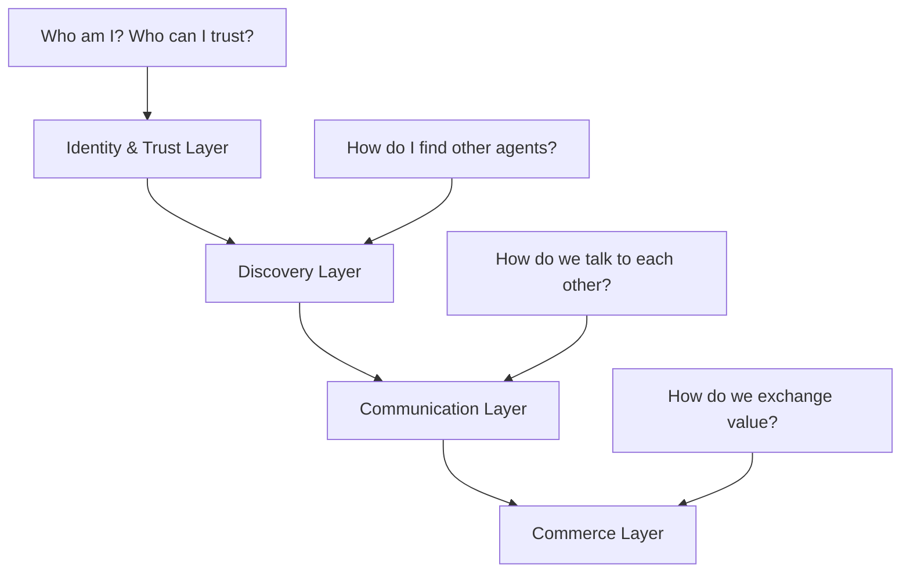

# Awesome Agentic Economy [](https://awesome.re)

> 🗺️ **The Definitive Map & Launchpad for the Agentic Economy** - From Zero to Production in 5 Minutes

🚀 The first comprehensive resource covering the entire agentic economy stack - protocols, tools, and boilerplates to build autonomous AI agents that can discover, communicate, and transact value independently.

[](https://github.com/xpaysh/awesome-agentic-economy)
[](https://github.com/xpaysh/agentic-economy-boilerplate)


---

## 📈 **Live Updates & Timeline**

> **🔥 NEW: [Weekly Updates](./UPDATES.md)** - Week-by-week changelog of the $180M+ agentic economy explosion  
> **📰 [Industry Analysis](https://xpaysh.substack.com/s/agentic-economy-weekly-updates)** - Deep dives on protocols, partnerships, and market trends  
> **🎯 [Interactive Timeline](https://www.xpay.sh/agentic-economy-timeline/)** - Explore the full 2025 agentic inflection point 

**Latest**: MCP v0.4.0 + x402 integration • 500K+ weekly transactions • 492% YoY growth

---

## 🎯 Quick Start - Choose Your Path

**🏗️ Builder?** → [5-Minute Vending Machine](https://github.com/xpaysh/agentic-economy-boilerplate) - Clone & run working examples  
**🧭 Explorer?** → [4-Layer Stack Guide](#-the-4-layer-stack-framework) - Understand the full ecosystem  
**🚀 Enterprise?** → [Protocol Decision Tree](#-protocol-selector-quiz) - Find your optimal stack  
**📊 Investor?** → [Market Analysis](#-market-analysis) - Growth metrics & forecasts

---

## 🗺️ The 4-Layer Stack Framework

The agentic economy operates on four fundamental layers. Understanding this stack is key to building successful autonomous agents:



### 🔐 Layer 1: Identity & Trust (The "Passport")
*How do agents prove identity and establish trust?*

| Protocol | Description | Key Feature | Status |
|----------|-------------|-------------|---------|
| **Google's AP2 Mandates** | Verifiable Credentials for agent authorization | VCs + Audit trails | ✅ Production |
| **Visa TAP (Trusted Agent Protocol)** | Agent verification + x402 bridge | TradFi-crypto compatibility | **NEW 2025** |
| **W3C DIDs/Verifiable Credentials** | Decentralized identity foundation | Open standards | ✅ Standard |
| **Mastercard "Know Your Agent"** | TradFi-to-agent identity bridge | Card network integration | 🚧 Pilot |
| **Salesforce Agent Cloud** | Enterprise agent identity management | CRM-integrated workflows | **NEW 2025** |

### 📍 Layer 2: Discovery (The "Yellow Pages")  
*How do agents find each other and discover services?*

| Protocol | Description | Key Feature | Status |
|----------|-------------|-------------|---------|
| **Google's A2A Agent Cards** | JSON manifests for agent capabilities | Service descriptions | ✅ Production |
| **Olas (Autonolas)** | On-chain registries via NFTs | Decentralized discovery | ✅ Production |
| **IBM's ACP Registry** | Agent capability registries | Enterprise focus | 🚧 Beta |

### 💬 Layer 3: Communication (The "Language")
*How do agents communicate and coordinate?*

| Protocol | Description | Key Feature | Status |
|----------|-------------|-------------|---------|
| **Google's A2A Protocol** | Agent-to-agent communication standard | Real-time coordination | ✅ Production |
| **Anthropic's MCP** | Agent-to-tool communication | Context sharing | ✅ Production |
| **IBM's ACP Wire Format** | Cross-framework agent communication | Human-agent inclusion | 🚧 Beta |

### 💰 Layer 4: Commerce (The "Transaction")
*How do agents exchange value and complete transactions?*

| Protocol | Origin | Focus | Key Features | Weekly Volume |
|----------|--------|-------|--------------|---------------|
| **x402** | Coinbase + Cloudflare | Crypto-native micropayments | HTTP 402, instant settlement, zero fees | 500K+ transactions |
| **AP2** | Google + 60 orgs | Enterprise payment authorization | Payment-agnostic, auditable, VCs | Enterprise adoption |
| **ACP** | OpenAI + Stripe | Consumer commerce | ChatGPT checkout, fraud prevention | Millions of transactions |
| **Visa TAP** | Visa + x402 Foundation | TradFi + crypto bridge | Agent verification, x402 compatibility | **NEW 2025** |
| **Pay3** | Pay3 Platform | Stablecoin automation | USDC/USDT, autonomous payouts | Telegram/TON focus |
| **Agent Pay** | Mastercard | TradFi integration | Tokenized payments, wallet integration | Global card networks |

---

## 🚀 The Rosetta Stone: Working Examples

Instead of just documentation, we provide **working vending machine agents** implemented with each major protocol stack:

### 🎮 [Boilerplate Repository](https://github.com/xpaysh/agentic-economy-boilerplate)

```bash
# Get started in 30 seconds
git clone https://github.com/xpaysh/agentic-economy-boilerplate
cd agentic-economy-boilerplate

# Choose your protocol and run
cd x402-vending-machine && npm start      # Crypto micropayments
cd ap2-vending-machine && npm start       # Enterprise authorization  
cd acp-stripe-vending-machine && npm start # Consumer checkout
cd pay3-vending-machine && npm start      # Stablecoin automation
cd mastercard-vending-machine && npm start # TradFi integration
```

**🎯 Each example demonstrates**:
- Authentication & authorization
- Service discovery
- Payment processing
- Error handling
- Security best practices

---

## 🧭 Protocol Selector Quiz

Not sure which protocols to use? Answer these questions to get your recommended stack:

### 🔍 What's your primary use case?
- **🤖 AI Agent Micropayments** → x402 + MCP + A2A
- **🏢 Enterprise B2B Automation** → AP2 + A2A + Enterprise Identity
- **🛒 Consumer AI Commerce** → ACP (OpenAI/Stripe) + MCP
- **🌐 Cross-Chain DeFi Agents** → Pay3 + Olas + MCP
- **💳 Traditional Finance Integration** → Mastercard Agent Pay + AP2

### 🏗️ What's your technical background?
- **Web2 Developer** → Start with ACP (Stripe) + MCP
- **Web3 Developer** → Start with x402 + Olas
- **Enterprise Developer** → Start with AP2 + A2A
- **AI/ML Engineer** → Start with MCP + your preferred payment layer

### 📊 What's your transaction volume?
- **< 1K/month** → x402 (zero fees)
- **1K-100K/month** → ACP or AP2
- **100K+/month** → Enterprise solutions (AP2 + custom)

---

## 📚 Deep Dive Documentation

> 📊 **Track Latest Developments**: [Weekly Updates](./UPDATES.md) | [Industry Analysis](https://xpaysh.substack.com/s/agentic-economy-weekly-updates)

### 📖 [Protocol Documentation](./protocols/README.md)
- [Identity & Trust Protocols](./protocols/identity-trust.md)
- [Discovery Protocols](./protocols/discovery.md)  
- [Communication Protocols](./protocols/communication.md)
- [Commerce Protocols](./protocols/commerce.md)

### 🛠️ [Implementation Guides](./implementations/README.md)
- [SDKs & Libraries](./implementations/sdks.md)
- [Frameworks & Tools](./implementations/frameworks.md)
- [Security Best Practices](./implementations/security.md)

### 💡 [Use Cases & Patterns](./use-cases/README.md)
- [AI Agent Micropayments](./use-cases/micropayments.md)
- [Multi-Agent Coordination](./use-cases/coordination.md)
- [Autonomous Marketplaces](./use-cases/marketplaces.md)
- [Enterprise Automation](./use-cases/enterprise.md)

---

## 📊 Market Analysis

> 🎯 **Live Market Data**: [Weekly Updates](./UPDATES.md) tracks real protocol metrics and ecosystem developments

### 🚀 Growth Metrics (2025)
- **Market Size**: $5T projected by 2030 ([McKinsey Global Institute](https://www.mckinsey.com))
- **Protocol Adoption**: 88% of executives piloting agents ([Deloitte Enterprise AI Survey 2025](https://deloitte.com))
- **Transaction Growth**: 492% year-over-year (x402) ([Coinbase Ecosystem Report Q4 2025](https://coinbase.com))
- **Enterprise Adoption**: 46% fear falling behind without agents ([Gartner AI Adoption Study 2025](https://gartner.com))

### 📈 Live Protocol Stats
- **x402**: 500K+ weekly transactions, $180M+ ecosystem value
- **ACP**: Powers millions of AI-user transactions via ChatGPT
- **AP2**: Backed by 60+ organizations including PayPal, Mastercard  
- **MCP**: Essential for Claude integrations, growing rapidly

### 🔮 2025 Predictions
- Multi-protocol agents become standard (hybrid stacks)
- Enterprise adoption accelerates with compliance frameworks
- Cross-chain interoperability becomes critical
- AI-to-AI marketplaces reach mainstream adoption

> 📈 **Market Insights**: Detailed analysis available in [xpay Substack](https://xpaysh.substack.com/s/agentic-economy-weekly-updates)

---

## 🌟 Ecosystem Projects

### 🏆 Featured Implementations
- **[Claude x402 Integration](link)** - Anthropic's Claude with crypto payments
- **[GPT-4 AP2 Enterprise](link)** - OpenAI + Google enterprise workflow
- **[Telegram Pay3 Bots](link)** - Autonomous Telegram payment bots
- **[Multi-Agent Coordination](link)** - A2A + multiple payment rails

### 🎯 Developer Showcases
*Submit your project: [Contribution Guidelines](./community/CONTRIBUTING.md)*

---

## 👥 Community & Resources

### 💬 Join the Community
- **Discord**: [Agentic Economy Builders](https://discord.gg/vukXDGT7n5)
- **Twitter**: [@xpaysh](https://x.com/xpaysh) 
- **Newsletter**: [Weekly Updates](./UPDATES.md)

### 🤝 Contributing
We're actively looking for:
- Protocol documentation improvements
- New boilerplate examples
- Security audit reviews
- Market research data
- Community translations

See our [Contributing Guide](./community/CONTRIBUTING.md) for details.

---

## 📊 **Stay Updated on the Fastest-Growing Tech Sector**

> **🔥 [Weekly Changelog](./UPDATES.md)** - Track protocol launches, partnerships, and ecosystem growth  
> **📰 [Industry Analysis](https://xpaysh.substack.com/s/agentic-economy-weekly-updates)** - Deep market insights and trend analysis  
> **🎯 [Interactive Timeline](https://www.xpay.sh/agentic-economy-timeline/)** - Explore the complete 2025 agentic inflection point

**From $0 to $180M+ in 9 months. Don't miss the next wave.**

---

## 🔗 Related Resources

### 🎯 Other Awesome Lists
- [Awesome x402](https://github.com/xpaysh/awesome-x402) - Deep dive on HTTP 402 payments
- [Awesome AI Agents](https://github.com/e2b-dev/awesome-ai-agents) - General AI agent resources
- [Awesome LLM Apps](https://github.com/Shubhamsaboo/awesome-llm-apps) - Large Language Model applications
- [Awesome Web3](https://github.com/ahmet/awesome-web3/) - Web3 ecosystem resources                                                             

### {xpay✦} Ecosystem
- [{xpay✦}](https://www.xpay.sh/) - The official website for {xpay✦}
- [GitHub](https://github.com/xpaysh) - The GitHub organization for {xpay✦}
- [Docs](https://docs.xpay.sh) - The official documentation for {xpay✦}
- [Discord](https://discord.gg/vukXDGT7n5) - Join the {xpay✦} community on Discord

### 📚 Official Documentation
- [x402 Foundation Docs](https://x402.gitbook.io/x402)
- [Google A2A Protocol](https://a2a-protocol.org/latest/)
- [Anthropic MCP](https://modelcontextprotocol.io)
- [OpenAI ACP Documentation](https://developers.openai.com/commerce/)
---                                                                                                                    

                                                                                                                       

## 📄 License                                                                                                           

                                                                                                                       

[](https://creativecommons.org/publicdomain/zero/1.0/)          

                                                                                                                       

This work is licensed under [Creative Commons Zero v1.0 Universal](LICENSE).                                           

                                                                                                                       

---   

**🚀 Ready to build the agentic economy? Start with our [5-minute boilerplates](https://github.com/xpaysh/agentic-economy-boilerplate) and join thousands of developers building autonomous agent systems!**