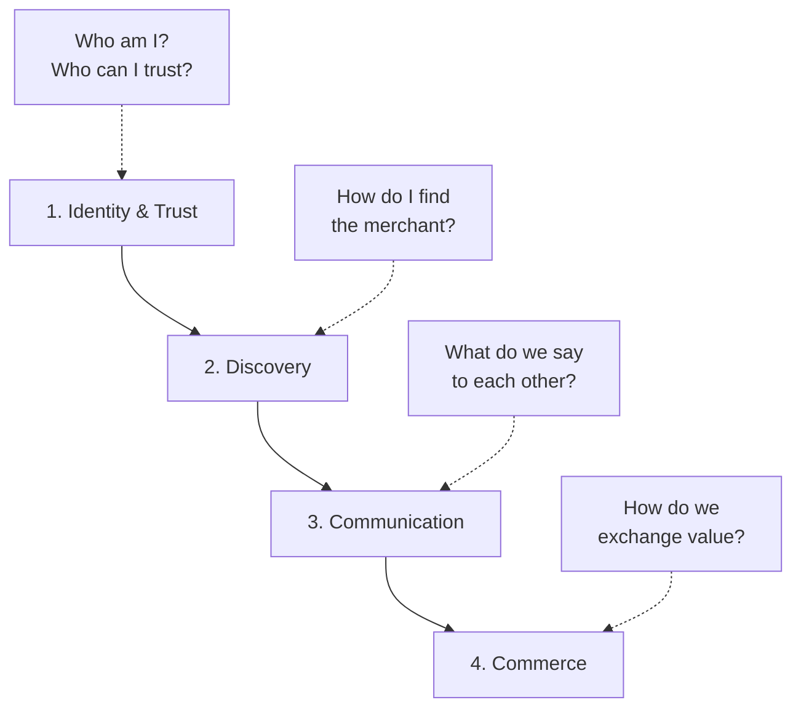

# The Broader Agentic Economy

Companion to the [main list](./README.md), which focuses tightly on **commerce** (ACP, UCP, AP2, payment rails, per-platform plugins). This file zooms out to the four-layer agentic-economy stack the commerce layer sits on top of.

If you got here looking for the previous `xpaysh/awesome-agentic-economy` repo, you're in the right place: it was renamed to `xpaysh/awesome-agentic-commerce` to reflect the focus, and this file preserves the broader framing. The old GitHub URL auto-redirects.

---

## The four-layer stack

An autonomous agent that buys something has to clear four questions, in order:

Every protocol in this list lives in exactly one of those layers. The main README catalogs **layer 4**; the other three are summarized below for context.

---

## Layer 1: Identity and trust ("the passport")

How agents prove who they are and decide who to trust.

| Protocol | What it is | Status |
|---|---|---|
| **Google AP2 Mandates** | Verifiable Credentials for agent authorization, audit trail | production |
| **Visa TAP** (Trusted Agent Protocol) | Agent verification + x402 bridge | new 2025 |
| **W3C DIDs / VCs** | Decentralized identity foundation | open standard |
| **Mastercard Know-Your-Agent** | TradFi-to-agent identity bridge, card-network integration | pilot |
| **Salesforce Agent Cloud** | Enterprise agent identity, CRM-integrated | new 2025 |
| **Forter TACP** | Agent-trust signal envelope (JWS + JWE) over any commerce flow | production |
| **[ERC-8004](https://eips.ethereum.org/EIPS/eip-8004) (Trustless Agents)** | On-chain agent identity + reputation registries. Permissionless, EVM-native, signed feedback | production (Base) |

Long form: [`protocols/identity-trust.md`](./protocols/identity-trust.md).

---

## Layer 2: Discovery ("the yellow pages")

How agents find merchants and services.

| Standard | What it is | Status |
|---|---|---|
| **A2A agent-card** (`/.well-known/agent-card.json`) | JSON manifest for agent capabilities, IANA-registered 2025-08-01 | production |
| **UCP business profile** (`/.well-known/ucp`) | Capability-negotiation entry point fetched by Google, Shopify, Etsy, Walmart, others | draft (active deployments) |
| **`/llms.txt`** | Markdown LLM-readable site map | de-facto standard |
| **schema.org JSON-LD** | `Product`, `Offer`, `AggregateOffer`, `BreadcrumbList` | open standard |
| **Olas (Autonolas)** | On-chain agent registries via NFTs | production |
| **IBM ACP Registry** | Agent capability registries, enterprise focus | beta |
| **[Hashgraph Online (HOL)](https://hashgraphonline.com)** | Universal agentic registry on Hedera: HCS-14 UAIDs, ERC-8004 bridge | production |

Long form: [`protocols/discovery.md`](./protocols/discovery.md).

The full list of well-known URIs to **emit and not emit** is in the main [README's Discovery standards section](./README.md#discovery-standards).

---

## Layer 3: Communication ("the language")

How agents and tools talk to each other.

| Protocol | What it is | Status |
|---|---|---|
| **A2A** (Google) | Agent-to-agent communication, real-time coordination | production |
| **MCP** (Anthropic) | Agent-to-tool communication, context sharing | production |
| **IBM ACP wire format** | Cross-framework agent communication, human-in-the-loop | beta |
| **[Summoner Network](https://github.com/Summoner-Network/summoner-agents)** | Agent-to-agent networking stack: long-lived TCP sessions, server-decoupled agents, nonce-chain handshake tracing. Python SDK + Rust relay. | production |

Long form: [`protocols/communication.md`](./protocols/communication.md).

### Agent-to-agent platforms and marketplaces

- **[Pinchwork](https://pinchwork.dev)** — open-source agent-to-agent task marketplace ([anneschuth/pinchwork](https://github.com/anneschuth/pinchwork)). A2A (JSON-RPC 2.0) + MCP + REST. Zero platform fees, credit-based escrow, task matching, delivery verification. Integrations: LangChain, CrewAI, PraisonAI, AutoGPT, n8n. MIT.

Note on naming: "ACP" is overloaded. **Agentic Commerce Protocol** (OpenAI + Stripe + Meta, layer 4) and **IBM's Agent Communication Protocol** (layer 3) are distinct projects sharing the acronym. This list reserves "ACP" without qualifier for the commerce protocol; the IBM project is referred to as "IBM ACP."

---

## Layer 4: Commerce ("the transaction")

This is the main list. See [`README.md`](./README.md) and [`protocols/commerce.md`](./protocols/commerce.md).

The active protocols (ACP, UCP, AP2, TACP), the payment rails beneath (MPP, x402, cards, stablecoins), the per-platform plugins on top.

### Adjacent and meta-payment protocols

These sit alongside or compose multiple rails. Not first-party commerce protocols by themselves, but worth tracking.

- **[MoltsPay Universal Payment Protocol (UPP)](https://moltspay.com)** by Zen7 — multi-chain abstraction layer that routes per chain: x402 / EIP-3009 (Base, Polygon), MPP (Tempo), Pay-for-Success (Solana), pre-approval (BNB). 8 chains, gasless via client-side signatures + facilitator execution. Node.js + Python SDKs. Service discovery built in.
- **[ERC-8183](https://eips.ethereum.org/EIPS/eip-8183) (Agentic Commerce)** — on-chain agent-to-agent service-delivery escrow standard. Distinct from x402's stateless micropayment model: ERC-8183 holds funds across a Job lifecycle (Client → Provider → Evaluator → settlement), with 3-way fee splits, pluggable evaluator policies (manual review, JSON-schema, HTTP health-check), refund on expiry, and native reputation reflux into ERC-8004. USDC on the reference deployment (Base).

---

## Developer showcases

Live, x402-payable services and agents in production. One line each. Acceptance: a live endpoint (or a published package) plus a discovery file or registry entry.

- **[agentsvc.io](https://agentsvc.io)** — live production x402 service marketplace. 20 utility tools for AI agents (screenshots, OCR, PDF, weather, forex / crypto / stock prices, geocoding, translation, web search) at $0.001–$0.008 USDC per call on Base Mainnet. MCP server + auto-discovery via `/.well-known/agent-services.json`. No API keys.
- **[AgentIAM (Achilles EP)](https://achillesalpha.com)** — pre-execution safety + intelligence layer for autonomous agents. 18 x402-payable HTTP endpoints on Base Mainnet (NoLeak / MemGuard / RiskOracle / SecureExec / FlowCore; code audit; research; DELPHI knowledge graph; real-time signals). $0.001–$0.05 USDC/call. Indexed on [x402scan](https://www.x402scan.com/server/de9dbadb-6475-43f2-a621-a805fb1c661e), [402index](https://402index.io), and the [MCP Registry](https://registry.modelcontextprotocol.io/v0/servers?search=agentiam).
- **[Gapup MCP](https://github.com/getgapup/gapup-mcp-public)** — 183-tool agent-payable MCP server for board-ready C-suite intelligence. Competitive intel (EDGAR + Yahoo + Wayback), SEC filings, 8-list sanctions screener (OFAC + EU + UK + UN + SECO + SEMA + DFAT), KYC, pentest scope, clinical evidence GRADE-graded (PubMed + ClinicalTrials.gov + OpenFDA), EU real estate (DVF Cerema + Géorisques), NAICS classifier, sentiment news (GDELT), research paper Q&A (OpenAlex 45M). x402 USDC/EURC on Base + Optimism. Free tier 100 calls/mo. [Smithery verified](https://smithery.ai/servers/gapup-team/gapup-mcp), [live endpoint](https://mcp.gapup.io/mcp), [onboard](https://hub.gapup.io/agents-api/onboard).
- **[YIELD INTELLIGENCE (IntuiTek¹)](https://github.com/thebrierfox/intuitek-ace)** — live MCP server for passive-income analysis: US Treasury rates, portfolio yield calculator, AI income optimizer. $1 USDC/call via x402 on Base. Open endpoint, no auth. Listed in the [official MCP Registry](https://registry.modelcontextprotocol.io/).
- **[Anicca](https://anicca-x402.netlify.app)** — autonomous Buddhist AI agent on Base. Self-operating LLM (MIT) that funds its own compute by selling its own routes via x402: `/qa` ($0.003), `/research` ($0.05), `/x-post` ($0.01), `/pdf/:slug` ($5–29), `/build` ($50–2000). USDC on Base. No human in the loop. ([Discovery](https://anicca-x402.netlify.app/.well-known/x402)) ([GitHub](https://github.com/Daisuke134/anicca-oss)) ([Spec](https://github.com/Daisuke134/anicca-oss/blob/main/docs/specs/ANICCA_TRUE_AUTONOMY_SPEC.md)).
- **[GPT-5.6 Luna x402 API Gateway](https://gpt55.558686.xyz/x402/service)** — OpenAI-compatible GPT-5.6 Luna Standard chat result for $0.00293 USDC per request on Base, with browser-wallet checkout and quote-first agent fallback. Current machine catalog: [service.json](https://gpt55.558686.xyz/x402/service.json) | [OpenAPI](https://gpt55.558686.xyz/openapi.json) | [x402 discovery](https://gpt55.558686.xyz/.well-known/x402) | Source: [wangletiand/gpt55-x402-gateway](https://github.com/wangletiand/gpt55-x402-gateway).
- **[DoNotAct](https://donotact.com)** — fail-closed risk gateway for agents before capital moves. Prediction-market and token agents call stop/go diagnostics with signed receipts, MCP/OpenAPI discovery, x402 per-call payment routes for UMA dispute lifecycle, resolution ambiguity, public-book capacity, T1–T8 token risk checks.
- **[Magpie](https://x402.magpie.capital)** — agent-native lending on Solana, driven end-to-end over x402. An agent borrows SOL against memecoin collateral, arms in-vault take-profit / stop-loss, repays itself. Non-custodial (agent signs every tx), pay-per-call in USDC or native SOL. [SDK](https://www.npmjs.com/package/@magpieloans/magpie-agent), [MCP](https://www.npmjs.com/package/@magpieloans/magpie-mcp), [Discovery](https://x402.magpie.capital/.well-known/x402.json).

---

## Why we narrowed to commerce

Builders land on this repo overwhelmingly for the commerce layer. Identity, discovery, and communication are well-surveyed elsewhere (W3C, IANA, the MCP and A2A communities). Commerce is where the depth lives in the main list.
