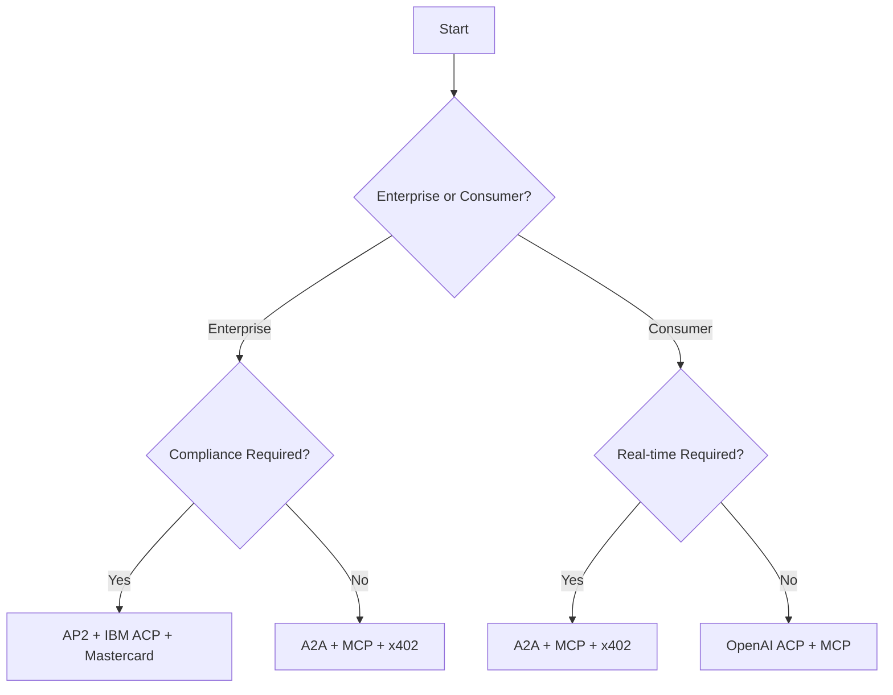

# Implementation Resources

This directory contains comprehensive implementation resources for building agentic economy applications, including SDKs, frameworks, tools, and best practices.

## 📚 Directory Structure

### 🛠️ Core Resources
- [SDKs & Libraries](./sdks.md) - Official and community SDKs for all major protocols
- [Frameworks & Tools](./frameworks.md) - Development frameworks and productivity tools  
- [Security Best Practices](./security.md) - Security implementations and guidelines

### 🏗️ Architecture Patterns
- [Multi-Protocol Integration](./integration-patterns.md) - Patterns for using multiple protocols together
- [Enterprise Architectures](./enterprise.md) - Large-scale deployment patterns
- [Edge Computing](./edge.md) - Distributed agent deployment strategies

### 📊 Performance & Monitoring
- [Performance Optimization](./performance.md) - Optimization techniques and benchmarks
- [Monitoring & Observability](./monitoring.md) - Tools for tracking agent performance
- [Testing Strategies](./testing.md) - Testing frameworks and methodologies

## 🚀 Quick Implementation Paths

### 🏃 **Fast Track (< 1 week)**
**Goal**: Get a working agent with basic capabilities
1. Choose one protocol from each layer (Identity, Discovery, Communication, Commerce)
2. Use our [boilerplate examples](https://github.com/xpaysh/agentic-economy-boilerplate)
3. Customize for your specific use case
4. Deploy to production

**Recommended Stack**:
- **Identity**: W3C DIDs (simple, decentralized)
- **Discovery**: Google A2A (mature, well-supported)
- **Communication**: MCP (excellent tooling)
- **Commerce**: x402 (zero fees, instant settlement)

### 🏢 **Enterprise Track (2-4 weeks)**
**Goal**: Production-ready enterprise agent system
1. Implement multi-protocol architecture
2. Add comprehensive security and compliance
3. Set up monitoring and observability
4. Create governance and approval workflows

**Recommended Stack**:
- **Identity**: Google AP2 + Mastercard KYA
- **Discovery**: IBM ACP Registry + A2A
- **Communication**: IBM ACP + A2A
- **Commerce**: AP2 + Mastercard Agent Pay

### 🌐 **Web3 Track (1-2 weeks)**
**Goal**: Fully decentralized agent ecosystem
1. Deploy on-chain identity and discovery
2. Use decentralized communication protocols
3. Implement crypto-native payments
4. Add governance mechanisms

**Recommended Stack**:
- **Identity**: W3C DIDs + on-chain verification
- **Discovery**: Olas (Autonolas) + XMTP
- **Communication**: XMTP + decentralized messaging
- **Commerce**: x402 + Pay3

## 🔧 Implementation Complexity Matrix

| Use Case | Complexity | Time to MVP | Recommended Path |
|----------|------------|-------------|------------------|
| **API Monetization** | Low | 2-3 days | x402 + MCP |
| **AI Agent Services** | Medium | 1-2 weeks | MCP + A2A + AP2 |
| **Enterprise Procurement** | High | 3-4 weeks | Full enterprise stack |
| **DeFi Agent Trading** | Medium | 1-2 weeks | Web3 stack |
| **Multi-Agent Coordination** | High | 2-3 weeks | A2A + IBM ACP |
| **Consumer AI Commerce** | Low | 3-5 days | ACP (OpenAI/Stripe) + MCP |

## 🏗️ Architecture Decision Framework

### Step 1: Define Requirements
```markdown
**Functional Requirements**
- [ ] Identity verification needed?
- [ ] Service discovery required?
- [ ] Real-time communication?
- [ ] Payment processing?
- [ ] Human approval workflows?

**Non-Functional Requirements**
- [ ] Expected transaction volume
- [ ] Latency requirements
- [ ] Security/compliance needs
- [ ] Scalability targets
- [ ] Budget constraints
```

### Step 2: Select Protocol Stack
Use our [Protocol Selector Quiz](../README.md#-protocol-selector-quiz) or decision tree:



### Step 3: Implementation Planning
```javascript
// Example implementation plan
const implementationPlan = {
  phase1: {
    duration: '1-2 weeks',
    scope: 'Core functionality',
    protocols: ['MCP', 'x402'],
    deliverables: ['Basic agent', 'Simple payments', 'Tool integration']
  },
  phase2: {
    duration: '1-2 weeks', 
    scope: 'Multi-agent coordination',
    protocols: ['A2A', 'Agent discovery'],
    deliverables: ['Agent coordination', 'Service discovery', 'Task delegation']
  },
  phase3: {
    duration: '1-2 weeks',
    scope: 'Production readiness',
    protocols: ['Security', 'Monitoring'],
    deliverables: ['Security hardening', 'Monitoring', 'Scalability']
  }
};
```

## 🛠️ Development Environment Setup

### Prerequisites
```bash
# Node.js 18+ (for most SDKs)
node --version

# Python 3.9+ (for AI/ML integrations)
python --version

# Docker (for containerized deployment)
docker --version

# Git (for version control)
git --version
```

### Quick Setup Script
```bash
#!/bin/bash
# setup-agentic-dev.sh

echo "Setting up Agentic Economy development environment..."

# Clone boilerplate repository
git clone https://github.com/xpaysh/agentic-economy-boilerplate
cd agentic-economy-boilerplate

# Install dependencies for all examples
for dir in */; do
  if [ -f "$dir/package.json" ]; then
    echo "Installing dependencies for $dir"
    cd "$dir"
    npm install
    cd ..
  fi
done

echo "✅ Environment setup complete!"
echo "📚 Check out the examples in each subdirectory"
echo "🚀 Start with: cd x402-vending-machine && npm start"
```

## 📊 Performance Benchmarks

### Protocol Performance Comparison
| Protocol | Setup Time | Message Latency | Throughput | Resource Usage |
|----------|------------|-----------------|------------|----------------|
| **x402** | < 5 min | 2-5 sec | 1K+ tx/min | Low |
| **A2A** | 10-30 min | < 1 sec | 10K+ msg/min | Medium |
| **MCP** | < 5 min | < 500ms | 5K+ calls/min | Low |
| **AP2** | 30-60 min | 1-3 sec | 1K+ tx/min | Medium |
| **XMTP** | 5-15 min | 2-10 sec | 100+ msg/min | Medium |

### Scaling Guidelines
```javascript
// Recommended scaling thresholds
const scalingGuidelines = {
  messages: {
    low: '< 1K/hour',      // Single instance
    medium: '1K-100K/hour', // Load balanced
    high: '> 100K/hour'     // Distributed architecture
  },
  transactions: {
    low: '< 100/hour',      // Basic setup
    medium: '100-10K/hour', // Enterprise setup
    high: '> 10K/hour'      // Multi-region deployment
  },
  agents: {
    small: '< 10 agents',   // Direct communication
    medium: '10-1000 agents', // Registry required
    large: '> 1000 agents'  // Distributed registries
  }
};
```

## 🔐 Security Implementation Checklist

### Basic Security (All Implementations)
- [ ] **Key Management**: Secure private key storage and rotation
- [ ] **Transport Security**: TLS/HTTPS for all communications  
- [ ] **Input Validation**: Sanitize all inputs and parameters
- [ ] **Rate Limiting**: Prevent abuse and DoS attacks
- [ ] **Audit Logging**: Log all transactions and decisions

### Advanced Security (Enterprise)
- [ ] **Multi-Factor Authentication**: For high-value operations
- [ ] **Zero-Trust Architecture**: Verify every interaction
- [ ] **Compliance Framework**: SOC 2, PCI DSS, GDPR compliance
- [ ] **Threat Detection**: Real-time monitoring and alerts
- [ ] **Incident Response**: Automated response procedures

### Web3 Security (Decentralized)
- [ ] **Smart Contract Audits**: Third-party security reviews
- [ ] **Private Key Security**: Hardware wallets, multi-sig
- [ ] **Oracle Security**: Reliable data feeds
- [ ] **MEV Protection**: Prevent front-running attacks
- [ ] **Governance Security**: Secure voting mechanisms

## 📈 Success Metrics & KPIs

### Technical Metrics
```yaml
performance:
  response_time: < 500ms (95th percentile)
  availability: > 99.9%
  throughput: meets business requirements
  error_rate: < 0.1%

security:
  failed_authentications: < 0.01%
  security_incidents: 0 per month
  compliance_score: > 95%

scalability:
  horizontal_scaling: automatic
  resource_utilization: 60-80%
  cost_per_transaction: decreasing trend
```

### Business Metrics
```yaml
adoption:
  agent_utilization: > 80%
  user_satisfaction: > 4.5/5
  roi: positive within 6 months

efficiency:
  process_automation: > 70%
  cost_reduction: > 30%
  time_savings: > 50%

growth:
  transaction_volume: increasing trend
  new_use_cases: monthly additions
  ecosystem_contributions: regular PRs
```

## 🤝 Getting Help

### Community Resources
- **Discord**: [Agentic Economy Builders](https://discord.gg/agentic-economy) - Real-time help
- **GitHub Issues**: Technical questions and bug reports  
- **Stack Overflow**: Tag questions with `agentic-economy`
- **Twitter**: [@AgenticEconomy](https://twitter.com/agenticeconomy) - Updates and announcements

### Professional Services
- **Architecture Consulting**: Custom implementation planning
- **Security Audits**: Third-party security assessments
- **Training Programs**: Team education and certification
- **Managed Services**: Hosted agent infrastructure

### Documentation and Tutorials
- [Official Protocol Documentation](../protocols/README.md)
- [Boilerplate Examples](https://github.com/xpaysh/agentic-economy-boilerplate)
- [Video Tutorials](./tutorials.md)
- [Best Practices Guide](./best-practices.md)

---

**🚀 Ready to build? Start with our [Quick Start Guide](../README.md#-quick-start---choose-your-path) and [Boilerplate Examples](https://github.com/xpaysh/agentic-economy-boilerplate)!**