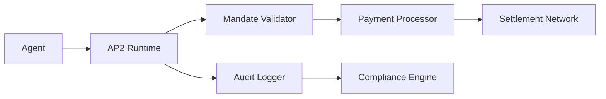
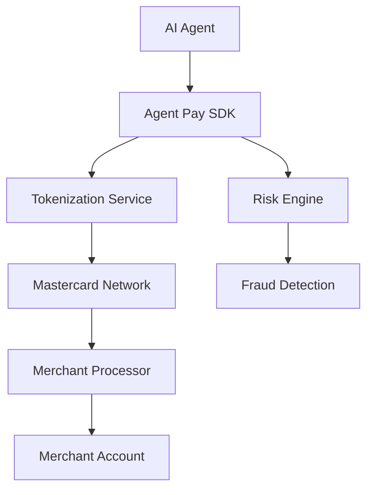

# Commerce Layer Protocols

The commerce layer enables agents to exchange value through various payment mechanisms. This is where autonomous economic activity becomes possible.

## 🎯 Protocol Overview

| Protocol | Origin | Focus | Key Innovation | Status |
|----------|--------|-------|----------------|--------|
| **x402** | Coinbase + Cloudflare | HTTP-native crypto payments | Activates dormant HTTP 402 status code | ✅ Production |
| **AP2** | Google + 60+ partners | Enterprise payment authorization | Verifiable credentials + payment agnostic | ✅ Production |
| **ACP** | OpenAI + Stripe | Consumer AI commerce | Seamless ChatGPT checkout experience | ✅ Production |
| **Pay3** | Pay3 Platform | Stablecoin automation | Autonomous USDC/USDT transactions | 🚧 Beta |
| **Mastercard Agent Pay** | Mastercard | TradFi integration | Tokenized payments via card networks | 🚧 Pilot |

---

## 🔥 x402 Protocol (Coinbase + Cloudflare)

### Overview
The x402 protocol revolutionizes web payments by activating the dormant HTTP 402 "Payment Required" status code, enabling instant cryptocurrency micropayments directly over HTTP.

### Key Features
- **HTTP-Native**: Uses standard HTTP 402 status code
- **Instant Settlement**: 2-second payment confirmation
- **Zero Fees**: No transaction fees for micropayments
- **Multi-Chain**: Supports Base, Ethereum, Solana
- **AI Agent Ready**: Designed for autonomous agent payments

### Technical Implementation
```http
GET /api/data HTTP/1.1
Host: example.com

HTTP/1.1 402 Payment Required
x402-accept: USDC
x402-amount: 0.01
x402-recipient: 0x742d35Cc6634C0532925a3b8D4060a653c4e
```

### Use Cases
- **Per-API-Call Payments**: Pay for each API request
- **Data Streaming**: Real-time data feeds with micropayments
- **AI Compute**: Agents paying for GPU cycles
- **Content Access**: Paywalled content without subscriptions

### Current Adoption
- **500K+ weekly transactions**
- **$180M+ ecosystem value**
- **492% year-over-year growth**
- **Integrated with Google's AP2**

### Getting Started
```bash
npm install @x402/sdk
```

```javascript
import { X402Client } from '@x402/sdk';

const client = new X402Client({
  privateKey: process.env.PRIVATE_KEY,
  network: 'base'
});

// Make a payment-required request
const response = await client.get('https://api.example.com/data');
// Automatically handles 402 payment flow
```

---

## 🏢 AP2 - Agent Payments Protocol (Google)

### Overview
Google's Agent Payments Protocol (AP2) provides a comprehensive framework for secure, auditable agent-initiated payments with support for multiple payment methods.

### Key Features
- **Payment Agnostic**: Supports cards, crypto, bank transfers
- **Verifiable Credentials**: Uses W3C VCs for agent authorization
- **Audit Trails**: Immutable transaction records
- **Enterprise Grade**: Built for high-volume business use
- **Multi-Party Support**: Complex payment workflows

### Architecture


### Mandate Types
1. **Cart Mandates**: Pre-approved shopping lists
2. **Intent Mandates**: Goal-based spending limits
3. **Recurring Mandates**: Subscription-style payments
4. **Emergency Mandates**: Time-sensitive transactions

### Implementation Example
```javascript
import { AP2Client } from '@google/ap2-sdk';

const agent = new AP2Client({
  agentId: 'agent-12345',
  credentials: verifiableCredential,
  mandateStore: './mandates/'
});

// Create a cart mandate
const mandate = await agent.createCartMandate({
  items: [
    { name: 'API Credits', price: 10.00, quantity: 1000 }
  ],
  maxTotal: 10.00,
  validUntil: Date.now() + 3600000 // 1 hour
});

// Execute payment
const payment = await agent.executePayment(mandate.id);
```

### Enterprise Integration
- **60+ partner organizations** including PayPal, Mastercard
- **Compliance-ready** with GDPR, PCI DSS
- **Multi-cloud support** (GCP, AWS, Azure)
- **Real-time monitoring** and alerting

---

## 💬 ACP - Agentic Commerce Protocol (OpenAI + Stripe)

### Overview
OpenAI's Agentic Commerce Protocol, developed with Stripe, enables seamless AI-driven purchases within conversational interfaces like ChatGPT.

### Key Features
- **Conversational Commerce**: Shop within chat interfaces
- **Fraud Prevention**: Advanced AI-powered fraud detection
- **Instant Checkout**: One-click purchase completion
- **Merchant Integration**: Easy Stripe merchant onboarding
- **Global Support**: International payment methods

### User Experience Flow
1. User expresses purchase intent in chat
2. AI agent presents product options
3. User confirms purchase details
4. Instant checkout via Stripe
5. Digital receipt and fulfillment

### Technical Architecture
```javascript
import { ACPAgent } from '@openai/acp-sdk';

const commerceAgent = new ACPAgent({
  stripeKey: process.env.STRIPE_KEY,
  openaiKey: process.env.OPENAI_KEY,
  merchantId: 'merchant-789'
});

// Handle purchase intent
await commerceAgent.handlePurchase({
  userIntent: "Buy noise-canceling headphones under $200",
  paymentMethod: "pm_1234567890",
  fulfillment: {
    type: 'digital',
    deliveryMethod: 'email'
  }
});
```

### Market Impact
- **Millions of transactions** processed via ChatGPT
- **Integrated with Salesforce** for enterprise workflows
- **Global merchant adoption** growing rapidly
- **AI-native commerce** becoming mainstream

---

## 💰 Pay3 Protocol

### Overview
Pay3 focuses on stablecoin-based autonomous payments, particularly for AI agents operating in decentralized environments.

### Key Features
- **Stablecoin Native**: USDC, USDT, and other stablecoins
- **Autonomous Payouts**: AI agents managing their own finances
- **Cross-Chain**: Multi-blockchain support
- **Telegram Integration**: Bot-based payment experiences
- **DeFi Integration**: Yield farming and liquidity provision

### Use Cases
- **Telegram Payment Bots**: Autonomous transaction processing
- **DeFi Agent Strategies**: Automated yield optimization
- **Cross-Border Payments**: Global stablecoin transfers
- **Gaming Economies**: In-game autonomous transactions

### Technical Implementation
```javascript
import { Pay3Client } from '@pay3/sdk';

const paymentAgent = new Pay3Client({
  privateKey: process.env.AGENT_PRIVATE_KEY,
  network: 'polygon',
  stablecoin: 'USDC'
});

// Autonomous payout
await paymentAgent.executePayout({
  recipient: '0x742d35Cc6634C0532925a3b8D440609653cbe',
  amount: 100.00,
  currency: 'USDC',
  memo: 'Service completion payment'
});
```

---

## 💳 Mastercard Agent Pay

### Overview
Mastercard's Agent Pay integrates autonomous payments with traditional card networks, bridging TradFi and the agentic economy.

### Key Features
- **Card Network Integration**: Existing Mastercard infrastructure
- **Tokenized Payments**: Secure agent payment tokens
- **Wallet Compatibility**: PayPal, Apple Pay, Google Pay integration
- **Global Reach**: Worldwide merchant acceptance
- **Enterprise Security**: Bank-grade security standards

### Architecture


### Implementation
```javascript
import { MastercardAgentPay } from '@mastercard/agent-pay';

const agentPay = new MastercardAgentPay({
  agentId: 'agent-mc-456',
  tokenizationKey: process.env.MC_TOKEN_KEY,
  merchantCategory: 'digital-services'
});

// Generate payment token
const paymentToken = await agentPay.createPaymentToken({
  amount: 50.00,
  currency: 'USD',
  merchantId: 'merchant-123'
});

// Execute payment
await agentPay.processPayment(paymentToken);
```

---

## 🔄 Cross-Protocol Integration

### Multi-Protocol Agent Architecture
Many advanced agents use multiple commerce protocols depending on the transaction context:

```javascript
class MultiProtocolAgent {
  constructor() {
    this.x402Client = new X402Client(config.x402);
    this.ap2Client = new AP2Client(config.ap2);
    this.acpClient = new ACPAgent(config.acp);
  }
  
  async selectPaymentProtocol(transaction) {
    if (transaction.amount < 1.0 && transaction.type === 'api-call') {
      return this.x402Client; // Micropayments
    }
    
    if (transaction.enterprise && transaction.audit_required) {
      return this.ap2Client; // Enterprise compliance
    }
    
    if (transaction.context === 'chat' && transaction.consumer) {
      return this.acpClient; // Consumer experience
    }
    
    return this.ap2Client; // Default enterprise
  }
}
```

### Decision Matrix

| Transaction Type | Amount | Context | Recommended Protocol |
|-----------------|--------|---------|---------------------|
| API Micropayment | < $1 | Programmatic | x402 |
| Enterprise Purchase | Any | B2B Workflow | AP2 |
| Consumer Commerce | < $500 | Chat Interface | ACP (OpenAI/Stripe) |
| Cross-Border | Any | International | Pay3 or Mastercard |
| Recurring Service | Any | Subscription | AP2 or Mastercard |

---

## 📊 Performance Comparison

| Protocol | Settlement Time | Fees | Scalability | Enterprise Ready |
|----------|----------------|------|-------------|------------------|
| x402 | 2 seconds | 0% | High | ✅ |
| AP2 | Varies by payment method | Payment method dependent | Very High | ✅ |
| ACP | ~30 seconds | Stripe fees (~2.9%) | High | ✅ |
| Pay3 | 10-60 seconds | Gas fees | Medium | 🔄 |
| Mastercard | Real-time | Interchange fees | Very High | ✅ |

---

## 🔐 Security Considerations

### Common Security Patterns
1. **Agent Authentication**: Verify agent identity before payments
2. **Payment Limits**: Implement spending caps and velocity limits
3. **Audit Trails**: Maintain immutable transaction logs
4. **Fraud Detection**: Real-time transaction monitoring
5. **Key Management**: Secure storage of payment credentials

### Best Practices
```javascript
// Secure agent payment configuration
const securePaymentConfig = {
  // Limit spending per time period
  dailyLimit: 1000.00,
  transactionLimit: 100.00,
  
  // Require multi-factor auth for large transactions
  mfaRequired: transaction => transaction.amount > 50.00,
  
  // Audit all transactions
  auditLogger: new AuditLogger({
    destination: 'immutable-log-service',
    encryption: true
  }),
  
  // Monitor for suspicious patterns
  fraudDetection: {
    velocityChecking: true,
    geolocationValidation: true,
    behaviorAnalysis: true
  }
};
```

---

## 🚀 Getting Started

### Quick Setup Guide
1. **Choose your primary protocol** based on use case
2. **Set up development environment** with SDK
3. **Implement basic payment flow** 
4. **Add security measures** (limits, monitoring)
5. **Test with small transactions**
6. **Scale to production volumes**

### Developer Resources
- [Protocol Comparison Tool](../tools/protocol-selector.md)
- [Security Checklist](../security/checklist.md)
- [Integration Examples](../examples/)
- [Testing Frameworks](../testing/)

Ready to implement commerce layer protocols? Check out our [boilerplate examples](https://github.com/xpaysh/agentic-economy-boilerplate) for working code you can run immediately!