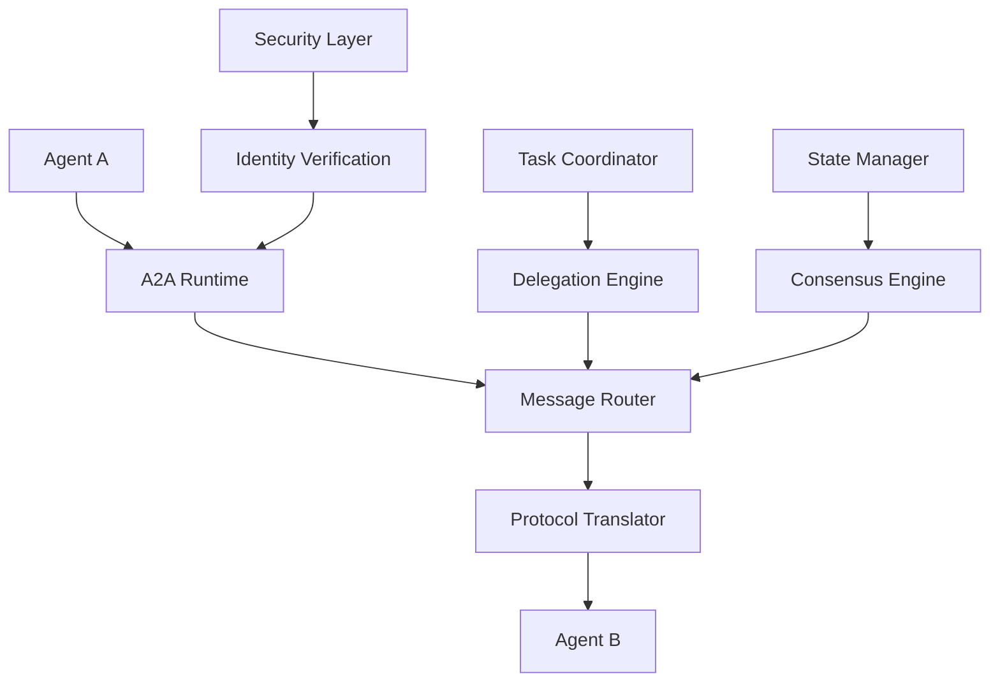
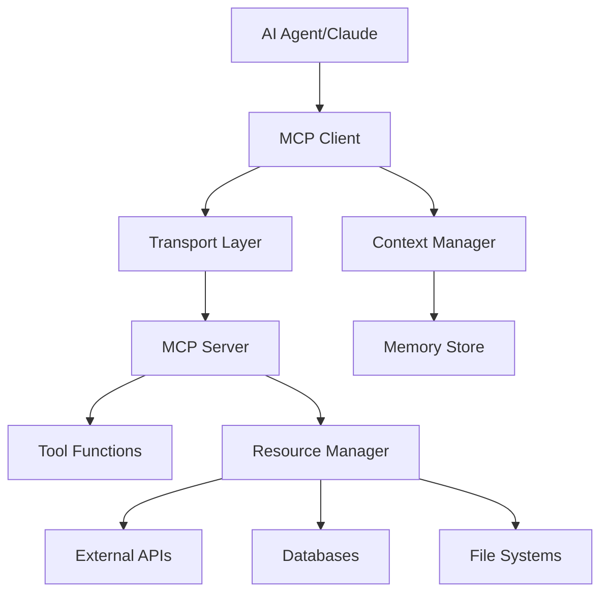
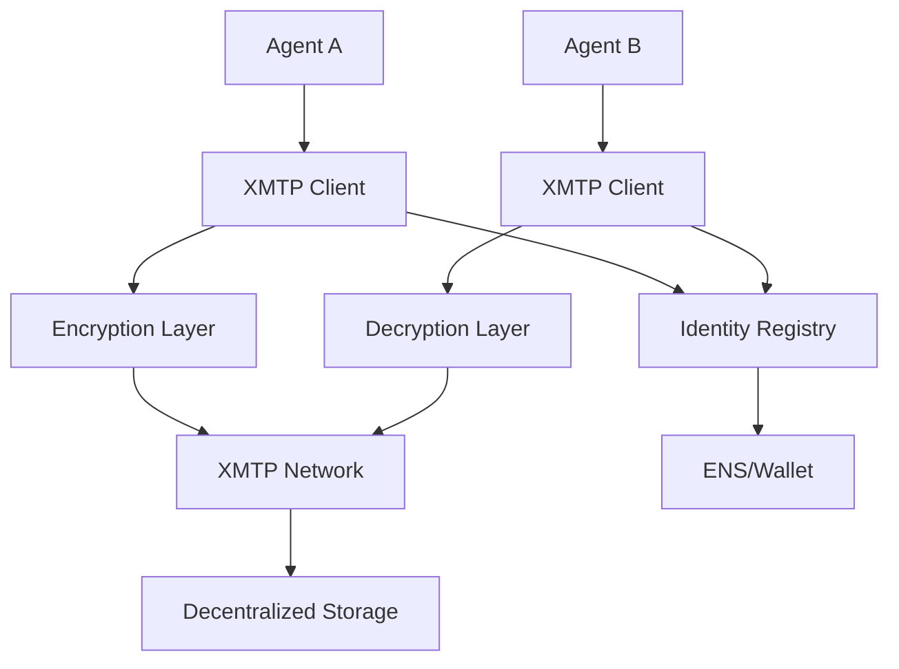

# Communication Layer Protocols

The communication layer enables autonomous agents to coordinate, exchange information, and collaborate effectively. This layer provides the "language" of the agentic economy, allowing agents to communicate with each other (A2A) and with external tools and systems (A2T) seamlessly.

## 🎯 Protocol Overview

| Protocol | Origin | Focus | Key Innovation | Status |
|----------|--------|-------|----------------|--------|
| **Google A2A Protocol** | Google + 50+ partners | Agent-to-agent communication | Real-time coordination + task delegation | ✅ Production |
| **Anthropic MCP** | Anthropic | Agent-to-tool communication | Contextual data transfer + stateless connections | ✅ Production |
| **IBM ACP Wire Format** | IBM + Linux Foundation | Cross-framework agent communication | Human-agent inclusion + wire protocol | 🚧 Beta |
| **XMTP Agent Messaging** | XMTP Labs | Decentralized agent messaging | Web3-native secure messaging | 🚧 Beta |
| **OpenAI Function Calling** | OpenAI | LLM-to-tool integration | Natural language tool invocation | ✅ Production |

---

## 🔄 Google A2A (Agent-to-Agent) Protocol

### Overview
Google's Agent-to-Agent (A2A) protocol enables autonomous agents to communicate, coordinate, and delegate tasks in real-time. It serves as the "HTTP for agents," providing standardized communication patterns for multi-agent workflows.

### Key Features
- **Real-Time Coordination**: Synchronous and asynchronous agent communication
- **Task Delegation**: Automated work distribution across agent networks
- **Status Synchronization**: Shared state management between agents
- **Protocol Agnostic**: Works with any underlying agent framework
- **Enterprise Integration**: Fits existing workflow and orchestration systems

### Technical Architecture


### Message Format
```json
{
  "a2a": {
    "version": "1.2.0",
    "messageId": "msg_1699123456789_abc123",
    "timestamp": "2025-01-20T15:30:00Z",
    "sender": {
      "agentId": "did:agent:procurement-bot-456",
      "capabilities": ["purchase", "negotiation"],
      "trustScore": 0.92
    },
    "recipient": {
      "agentId": "did:agent:supplier-manager-789",
      "requiredCapabilities": ["inventory-check", "pricing"]
    },
    "messageType": "task-delegation",
    "priority": "medium",
    "ttl": 3600
  },
  "payload": {
    "taskType": "inventory-inquiry",
    "taskId": "task_inventory_2025_001",
    "parameters": {
      "items": [
        {
          "sku": "LAPTOP-DEL-5520",
          "quantity": 25,
          "maxPrice": 1200.00
        }
      ],
      "deliveryDate": "2025-02-15",
      "qualityRequirements": ["new", "warranty-3yr"]
    },
    "responseRequired": true,
    "deadline": "2025-01-20T16:00:00Z",
    "fallbackOptions": [
      {
        "action": "timeout",
        "agentId": "did:agent:backup-supplier-123"
      }
    ]
  },
  "security": {
    "signature": "eyJhbGciOiJFZERTQSJ9...",
    "encryptionLevel": "standard",
    "auditRequired": true
  }
}
```

### Implementation Example
```javascript
import { A2AClient, MessageBuilder, TaskDelegator } from '@google/a2a-sdk';

class ProcurementCoordinator {
  constructor() {
    this.a2a = new A2AClient({
      agentId: 'did:agent:procurement-coordinator-001',
      privateKey: process.env.AGENT_PRIVATE_KEY,
      networkEndpoints: ['wss://a2a.google.com/v1', 'wss://backup.a2a.com/v1']
    });
    
    this.taskDelegator = new TaskDelegator(this.a2a);
    this.activeConversations = new Map();
  }
  
  async delegateInventoryCheck(items, requirements) {
    // Find suitable supplier agents
    const supplierAgents = await this.a2a.discoverAgents({
      capabilities: ['inventory-check', 'pricing'],
      trustScore: { min: 0.8 },
      responseTime: { max: 30 }, // seconds
      geolocation: requirements.preferredRegions
    });
    
    if (supplierAgents.length === 0) {
      throw new Error('No suitable supplier agents found');
    }
    
    // Create delegation task
    const task = new MessageBuilder()
      .setType('task-delegation')
      .setPriority('medium')
      .setPayload({
        taskType: 'inventory-inquiry',
        parameters: {
          items,
          deliveryDate: requirements.deliveryDate,
          qualityRequirements: requirements.quality
        },
        responseRequired: true,
        deadline: new Date(Date.now() + 30 * 60 * 1000) // 30 minutes
      })
      .build();
    
    // Delegate to multiple agents for redundancy
    const delegationPromises = supplierAgents.slice(0, 3).map(async (agent) => {
      const response = await this.taskDelegator.delegate(agent.agentId, task, {
        timeout: 30000,
        retryAttempts: 2,
        fallbackBehavior: 'continue'
      });
      
      return {
        agentId: agent.agentId,
        response,
        timestamp: new Date()
      };
    });
    
    // Wait for first successful response or all to complete
    const results = await Promise.allSettled(delegationPromises);
    const successful = results.filter(r => r.status === 'fulfilled').map(r => r.value);
    
    if (successful.length === 0) {
      throw new Error('All inventory check delegations failed');
    }
    
    // Aggregate and validate responses
    return this.aggregateInventoryResponses(successful);
  }
  
  async handleIncomingMessage(message) {
    const { sender, messageType, payload } = message;
    
    switch (messageType) {
      case 'task-response':
        await this.handleTaskResponse(sender, payload);
        break;
        
      case 'task-delegation':
        await this.handleTaskDelegation(sender, payload);
        break;
        
      case 'status-update':
        await this.handleStatusUpdate(sender, payload);
        break;
        
      case 'negotiation-proposal':
        await this.handleNegotiationProposal(sender, payload);
        break;
        
      default:
        console.warn(`Unknown message type: ${messageType}`);
    }
  }
  
  async startNegotiation(agentId, negotiationParameters) {
    const negotiationId = `neg_${Date.now()}_${Math.random().toString(36).substr(2, 9)}`;
    
    const negotiationMessage = new MessageBuilder()
      .setType('negotiation-start')
      .setRecipient(agentId)
      .setPayload({
        negotiationId,
        parameters: negotiationParameters,
        rounds: { max: 5, current: 1 },
        timeout: 300000 // 5 minutes per round
      })
      .build();
    
    // Start negotiation conversation
    const conversation = await this.a2a.startConversation(agentId, negotiationMessage);
    this.activeConversations.set(negotiationId, conversation);
    
    return new Promise((resolve, reject) => {
      conversation.onMessage(async (message) => {
        if (message.messageType === 'negotiation-complete') {
          this.activeConversations.delete(negotiationId);
          resolve(message.payload.finalTerms);
        } else if (message.messageType === 'negotiation-failed') {
          this.activeConversations.delete(negotiationId);
          reject(new Error(message.payload.reason));
        }
      });
      
      conversation.onTimeout(() => {
        this.activeConversations.delete(negotiationId);
        reject(new Error('Negotiation timeout'));
      });
    });
  }
}
```

### Multi-Agent Coordination Patterns
```javascript
class MultiAgentOrchestrator {
  async executeParallelWorkflow(workflow) {
    const { tasks, dependencies, timeout } = workflow;
    const taskResults = new Map();
    const pendingTasks = new Set(tasks.map(t => t.id));
    
    // Execute tasks respecting dependencies
    while (pendingTasks.size > 0) {
      const readyTasks = tasks.filter(task => 
        pendingTasks.has(task.id) && 
        this.areDependenciesMet(task.dependencies, taskResults)
      );
      
      if (readyTasks.length === 0) {
        throw new Error('Circular dependency detected in workflow');
      }
      
      // Execute ready tasks in parallel
      const taskPromises = readyTasks.map(async (task) => {
        const agent = await this.selectBestAgent(task.requiredCapabilities);
        const result = await this.delegateTask(agent.agentId, task);
        
        taskResults.set(task.id, result);
        pendingTasks.delete(task.id);
        
        return { taskId: task.id, result };
      });
      
      await Promise.all(taskPromises);
    }
    
    return this.aggregateWorkflowResults(taskResults, workflow.outputMapping);
  }
  
  async executeConditionalWorkflow(workflow) {
    let currentStep = workflow.startStep;
    const executionTrace = [];
    
    while (currentStep) {
      const step = workflow.steps[currentStep];
      const agent = await this.selectBestAgent(step.requiredCapabilities);
      
      const result = await this.delegateTask(agent.agentId, step.task);
      executionTrace.push({ step: currentStep, agent: agent.agentId, result });
      
      // Determine next step based on result
      if (step.conditions) {
        currentStep = this.evaluateConditions(step.conditions, result);
      } else {
        currentStep = step.nextStep;
      }
    }
    
    return {
      finalResult: executionTrace[executionTrace.length - 1].result,
      trace: executionTrace
    };
  }
}
```

---

## 🔧 Anthropic MCP (Model Context Protocol)

### Overview
Anthropic's Model Context Protocol (MCP) standardizes how AI agents connect with external tools, databases, and systems. It enables contextual data transfer and tool invocation in stateless environments.

### Key Features
- **Stateless Architecture**: No persistent connections required
- **Context Preservation**: Maintains conversation context across tool calls
- **Type Safety**: Strongly typed interface definitions
- **Resource Management**: Efficient handling of external data sources
- **Security First**: Built-in authentication and authorization

### Technical Architecture


### Server Implementation
```typescript
import { Server } from '@modelcontextprotocol/sdk/server/index.js';
import { StdioServerTransport } from '@modelcontextprotocol/sdk/server/stdio.js';
import { 
  CallToolRequestSchema, 
  ListToolsRequestSchema,
  Tool 
} from '@modelcontextprotocol/sdk/types.js';

class ProcurementMCPServer {
  private server: Server;
  private suppliers: Map<string, any>;
  
  constructor() {
    this.server = new Server({
      name: 'procurement-tools',
      version: '1.0.0'
    }, {
      capabilities: {
        tools: {},
        resources: {},
        prompts: {}
      }
    });
    
    this.suppliers = new Map();
    this.setupHandlers();
  }
  
  private setupHandlers() {
    // List available tools
    this.server.setRequestHandler(ListToolsRequestSchema, async () => {
      return {
        tools: [
          {
            name: 'check_inventory',
            description: 'Check product inventory across suppliers',
            inputSchema: {
              type: 'object',
              properties: {
                sku: { type: 'string', description: 'Product SKU' },
                quantity: { type: 'number', description: 'Required quantity' },
                maxPrice: { type: 'number', description: 'Maximum acceptable price' }
              },
              required: ['sku', 'quantity']
            }
          },
          {
            name: 'create_purchase_order',
            description: 'Create a purchase order with selected supplier',
            inputSchema: {
              type: 'object',
              properties: {
                supplierId: { type: 'string' },
                items: {
                  type: 'array',
                  items: {
                    type: 'object',
                    properties: {
                      sku: { type: 'string' },
                      quantity: { type: 'number' },
                      agreedPrice: { type: 'number' }
                    }
                  }
                },
                deliveryDate: { type: 'string', format: 'date' }
              },
              required: ['supplierId', 'items']
            }
          },
          {
            name: 'negotiate_price',
            description: 'Negotiate price with supplier',
            inputSchema: {
              type: 'object',
              properties: {
                supplierId: { type: 'string' },
                sku: { type: 'string' },
                currentPrice: { type: 'number' },
                targetPrice: { type: 'number' },
                quantity: { type: 'number' }
              },
              required: ['supplierId', 'sku', 'currentPrice', 'targetPrice']
            }
          }
        ]
      };
    });
    
    // Handle tool calls
    this.server.setRequestHandler(CallToolRequestSchema, async (request) => {
      const { name, arguments: args } = request.params;
      
      switch (name) {
        case 'check_inventory':
          return await this.checkInventory(args);
        case 'create_purchase_order':
          return await this.createPurchaseOrder(args);
        case 'negotiate_price':
          return await this.negotiatePrice(args);
        default:
          throw new Error(`Unknown tool: ${name}`);
      }
    });
  }
  
  private async checkInventory(args: any) {
    const { sku, quantity, maxPrice } = args;
    const availableSuppliers = [];
    
    // Query multiple suppliers
    for (const [supplierId, supplier] of this.suppliers) {
      try {
        const inventory = await supplier.checkInventory(sku);
        
        if (inventory.available >= quantity) {
          const pricing = await supplier.getPricing(sku, quantity);
          
          if (!maxPrice || pricing.unitPrice <= maxPrice) {
            availableSuppliers.push({
              supplierId,
              supplierName: supplier.name,
              available: inventory.available,
              unitPrice: pricing.unitPrice,
              totalPrice: pricing.unitPrice * quantity,
              leadTime: pricing.leadTime,
              rating: supplier.rating
            });
          }
        }
      } catch (error) {
        console.warn(`Failed to check inventory with ${supplierId}:`, error.message);
      }
    }
    
    // Sort by price and rating
    availableSuppliers.sort((a, b) => {
      const scoreA = a.totalPrice * (2 - a.rating); // Lower is better
      const scoreB = b.totalPrice * (2 - b.rating);
      return scoreA - scoreB;
    });
    
    return {
      content: [
        {
          type: 'text',
          text: JSON.stringify({
            sku,
            requestedQuantity: quantity,
            suppliersFound: availableSuppliers.length,
            suppliers: availableSuppliers,
            recommendation: availableSuppliers[0] || null
          }, null, 2)
        }
      ]
    };
  }
  
  private async createPurchaseOrder(args: any) {
    const { supplierId, items, deliveryDate } = args;
    const supplier = this.suppliers.get(supplierId);
    
    if (!supplier) {
      throw new Error(`Supplier ${supplierId} not found`);
    }
    
    const purchaseOrder = {
      id: `PO_${Date.now()}`,
      supplierId,
      items,
      deliveryDate,
      totalAmount: items.reduce((sum: number, item: any) => sum + (item.quantity * item.agreedPrice), 0),
      status: 'pending',
      createdAt: new Date().toISOString()
    };
    
    // Submit to supplier
    const confirmation = await supplier.createPurchaseOrder(purchaseOrder);
    
    return {
      content: [
        {
          type: 'text',
          text: JSON.stringify({
            success: true,
            purchaseOrder: {
              ...purchaseOrder,
              supplierConfirmation: confirmation
            }
          }, null, 2)
        }
      ]
    };
  }
  
  private async negotiatePrice(args: any) {
    const { supplierId, sku, currentPrice, targetPrice, quantity } = args;
    const supplier = this.suppliers.get(supplierId);
    
    if (!supplier) {
      throw new Error(`Supplier ${supplierId} not found`);
    }
    
    // Implement negotiation logic
    const negotiationSteps = [];
    let currentOffer = currentPrice;
    let rounds = 0;
    const maxRounds = 3;
    
    while (rounds < maxRounds && currentOffer > targetPrice) {
      const reduction = Math.min(currentOffer * 0.1, (currentOffer - targetPrice) / 2);
      const proposedPrice = currentOffer - reduction;
      
      negotiationSteps.push({
        round: rounds + 1,
        ourOffer: proposedPrice,
        justification: quantity > 100 ? 'Volume discount' : 'Competitive pricing'
      });
      
      // Simulate supplier response
      const accepted = Math.random() > 0.4; // 60% acceptance rate
      if (accepted) {
        negotiationSteps[negotiationSteps.length - 1].response = 'accepted';
        break;
      } else {
        const counterOffer = proposedPrice + (reduction * 0.5);
        negotiationSteps[negotiationSteps.length - 1].response = 'counter-offer';
        negotiationSteps[negotiationSteps.length - 1].counterOffer = counterOffer;
        currentOffer = counterOffer;
      }
      
      rounds++;
    }
    
    const finalPrice = negotiationSteps[negotiationSteps.length - 1].counterOffer || 
                      negotiationSteps[negotiationSteps.length - 1].ourOffer;
    
    return {
      content: [
        {
          type: 'text',
          text: JSON.stringify({
            sku,
            originalPrice: currentPrice,
            targetPrice,
            finalPrice,
            savingsPercent: ((currentPrice - finalPrice) / currentPrice * 100).toFixed(2),
            negotiationSteps
          }, null, 2)
        }
      ]
    };
  }
  
  async start() {
    const transport = new StdioServerTransport();
    await this.server.connect(transport);
    console.error('Procurement MCP Server running on stdio');
  }
}
```

### Client Integration (Claude)
```typescript
import { Client } from '@modelcontextprotocol/sdk/client/index.js';
import { StdioClientTransport } from '@modelcontextprotocol/sdk/client/stdio.js';

class AgentWithMCP {
  private mcpClient: Client;
  private availableTools: Map<string, any>;
  
  constructor() {
    this.availableTools = new Map();
  }
  
  async initialize() {
    // Connect to MCP server
    const transport = new StdioClientTransport({
      command: 'node',
      args: ['dist/procurement-mcp-server.js']
    });
    
    this.mcpClient = new Client({
      name: 'procurement-agent',
      version: '1.0.0'
    }, {
      capabilities: {
        sampling: {}
      }
    });
    
    await this.mcpClient.connect(transport);
    
    // Get available tools
    const toolsResponse = await this.mcpClient.listTools();
    toolsResponse.tools.forEach(tool => {
      this.availableTools.set(tool.name, tool);
    });
    
    console.log(`Connected to MCP server with ${toolsResponse.tools.length} tools`);
  }
  
  async executeProcurementTask(task: string) {
    // This would normally use Claude's reasoning to determine tool usage
    // For demo, we'll implement simple logic
    
    if (task.includes('check inventory') || task.includes('find suppliers')) {
      return await this.handleInventoryInquiry(task);
    } else if (task.includes('create order') || task.includes('purchase')) {
      return await this.handlePurchaseOrder(task);
    } else if (task.includes('negotiate') || task.includes('better price')) {
      return await this.handlePriceNegotiation(task);
    }
    
    return 'Task not recognized. Available capabilities: inventory check, purchase orders, price negotiation.';
  }
  
  private async handleInventoryInquiry(task: string) {
    // Extract parameters from natural language (simplified)
    const sku = this.extractSKU(task);
    const quantity = this.extractQuantity(task);
    const maxPrice = this.extractMaxPrice(task);
    
    const result = await this.mcpClient.callTool({
      name: 'check_inventory',
      arguments: { sku, quantity, maxPrice }
    });
    
    const data = JSON.parse(result.content[0].text);
    
    if (data.suppliersFound === 0) {
      return `No suppliers found for ${sku} with quantity ${quantity}${maxPrice ? ` under $${maxPrice}` : ''}.`;
    }
    
    const best = data.recommendation;
    return `Found ${data.suppliersFound} suppliers. Best option: ${best.supplierName} at $${best.unitPrice}/unit (total: $${best.totalPrice}) with ${best.leadTime} day lead time.`;
  }
  
  private async handlePurchaseOrder(task: string) {
    // Extract order details
    const supplierId = this.extractSupplierId(task);
    const items = this.extractItems(task);
    const deliveryDate = this.extractDeliveryDate(task);
    
    const result = await this.mcpClient.callTool({
      name: 'create_purchase_order',
      arguments: { supplierId, items, deliveryDate }
    });
    
    const data = JSON.parse(result.content[0].text);
    
    if (data.success) {
      return `Purchase order ${data.purchaseOrder.id} created successfully for $${data.purchaseOrder.totalAmount}. Delivery expected: ${deliveryDate}.`;
    }
    
    return 'Failed to create purchase order.';
  }
  
  private async handlePriceNegotiation(task: string) {
    const supplierId = this.extractSupplierId(task);
    const sku = this.extractSKU(task);
    const currentPrice = this.extractCurrentPrice(task);
    const targetPrice = this.extractTargetPrice(task);
    const quantity = this.extractQuantity(task);
    
    const result = await this.mcpClient.callTool({
      name: 'negotiate_price',
      arguments: { supplierId, sku, currentPrice, targetPrice, quantity }
    });
    
    const data = JSON.parse(result.content[0].text);
    
    return `Negotiation complete! Reduced price from $${data.originalPrice} to $${data.finalPrice} (${data.savingsPercent}% savings). Completed in ${data.negotiationSteps.length} rounds.`;
  }
  
  // Helper methods for natural language processing (simplified)
  private extractSKU(text: string): string {
    const match = text.match(/SKU[:\s]+(\w+[-\w]*)/i);
    return match ? match[1] : 'LAPTOP-DEL-5520'; // Default for demo
  }
  
  private extractQuantity(text: string): number {
    const match = text.match(/(\d+)[\s]*(units?|pieces?|qty)/i);
    return match ? parseInt(match[1]) : 10; // Default
  }
  
  private extractMaxPrice(text: string): number | undefined {
    const match = text.match(/under\s*\$?(\d+(?:\.\d+)?)/i);
    return match ? parseFloat(match[1]) : undefined;
  }
}
```

---

## 🔄 IBM ACP Wire Format & Cross-Framework Communication

### Overview
IBM's Agent Communication Protocol (ACP) provides a wire format for cross-framework agent communication, enabling agents built with different technologies to communicate seamlessly while including humans in the loop.

### Key Features
- **Cross-Framework Compatibility**: Works with any agent implementation
- **Human-Agent Integration**: Seamless human participation in agent workflows
- **Formal Protocol Specification**: Well-defined wire format and semantics
- **Enterprise Security**: Built-in authentication and authorization
- **Extensible Design**: Plugin architecture for custom capabilities

### Wire Format Specification
```json
{
  "acp": {
    "version": "2.1.0",
    "messageId": "acp_msg_1699123456789",
    "conversationId": "conv_procurement_workflow_001",
    "timestamp": "2025-01-20T15:30:00Z",
    "protocolExtensions": ["negotiation", "workflow", "human-loop"]
  },
  "participants": {
    "sender": {
      "id": "agent:procurement:ibm:watson-001",
      "type": "agent",
      "framework": "ibm-watson",
      "capabilities": ["purchase", "negotiate", "analyze"],
      "authentication": {
        "method": "certificate",
        "certificate": "-----BEGIN CERTIFICATE-----..."
      }
    },
    "recipients": [
      {
        "id": "agent:supplier:external:oracle-erp-integration",
        "type": "agent",
        "framework": "oracle-autonomous"
      },
      {
        "id": "human:approver:john.smith@corp.com",
        "type": "human", 
        "role": "procurement-manager"
      }
    ]
  },
  "message": {
    "type": "workflow-step",
    "action": "approval-request",
    "priority": "medium",
    "humanReadable": {
      "title": "Purchase Order Approval Required",
      "summary": "Requesting approval for $15,000 laptop purchase from Dell",
      "details": "25 Dell Latitude 5520 laptops at $600 each for new employee onboarding"
    },
    "machineReadable": {
      "workflowId": "workflow_laptop_procurement_2025_001",
      "stepId": "step_manager_approval",
      "data": {
        "purchaseOrder": {
          "id": "PO-2025-001",
          "supplier": "Dell Technologies",
          "items": [
            {
              "sku": "LAPTOP-DEL-5520",
              "description": "Dell Latitude 5520 Business Laptop",
              "quantity": 25,
              "unitPrice": 600.00,
              "totalPrice": 15000.00
            }
          ],
          "justification": "New employee laptop allocation for Q1 2025 hires",
          "budgetCode": "IT-EQUIPMENT-Q1-2025",
          "requestedDelivery": "2025-02-01"
        }
      }
    },
    "responseOptions": [
      {
        "action": "approve",
        "label": "Approve Purchase",
        "requiresHuman": true,
        "nextStep": "step_create_order"
      },
      {
        "action": "reject", 
        "label": "Reject Purchase",
        "requiresHuman": true,
        "nextStep": "step_cancel_workflow"
      },
      {
        "action": "request-modification",
        "label": "Request Changes",
        "requiresHuman": true,
        "nextStep": "step_modify_request"
      }
    ]
  },
  "security": {
    "encryption": "end-to-end",
    "signature": {
      "algorithm": "ES256",
      "value": "eyJhbGciOiJFUzI1NiJ9..."
    },
    "auditTrail": {
      "required": true,
      "classification": "internal",
      "retentionPeriod": "7years"
    }
  }
}
```

### Framework Implementation
```java
// IBM ACP Java Implementation
package com.ibm.acp.framework;

import com.ibm.acp.core.*;
import com.ibm.acp.security.*;
import com.ibm.acp.workflow.*;

@Component
public class ACPCommunicationManager {
    
    private final ACPMessageRouter messageRouter;
    private final SecurityManager securityManager;
    private final WorkflowEngine workflowEngine;
    private final HumanLoopIntegration humanLoop;
    
    @Autowired
    public ACPCommunicationManager(
            ACPMessageRouter messageRouter,
            SecurityManager securityManager,
            WorkflowEngine workflowEngine,
            HumanLoopIntegration humanLoop) {
        this.messageRouter = messageRouter;
        this.securityManager = securityManager;
        this.workflowEngine = workflowEngine;
        this.humanLoop = humanLoop;
    }
    
    public void sendMessage(ACPMessage message) throws ACPException {
        // Validate message format
        validateMessageFormat(message);
        
        // Apply security policies
        var securedMessage = securityManager.secureMessage(message);
        
        // Route to recipients
        for (var recipient : message.getRecipients()) {
            if (recipient.getType() == ParticipantType.AGENT) {
                routeToAgent(recipient, securedMessage);
            } else if (recipient.getType() == ParticipantType.HUMAN) {
                routeToHuman(recipient, securedMessage);
            }
        }
        
        // Update audit trail
        auditMessage(message, MessageEvent.SENT);
    }
    
    private void routeToAgent(Participant recipient, ACPMessage message) {
        var agentFramework = recipient.getFramework();
        var adapter = getFrameworkAdapter(agentFramework);
        
        if (adapter != null) {
            adapter.deliverMessage(recipient.getId(), message);
        } else {
            // Use generic HTTP/gRPC delivery
            genericDelivery(recipient, message);
        }
    }
    
    private void routeToHuman(Participant recipient, ACPMessage message) {
        // Convert to human-friendly format
        var humanMessage = convertToHumanFormat(message);
        
        // Determine delivery channel based on urgency and preference
        var channel = determineDeliveryChannel(message.getPriority(), recipient);
        
        switch (channel) {
            case EMAIL:
                humanLoop.sendEmail(recipient.getId(), humanMessage);
                break;
            case SLACK:
                humanLoop.sendSlackMessage(recipient.getId(), humanMessage);
                break;
            case MOBILE_APP:
                humanLoop.sendPushNotification(recipient.getId(), humanMessage);
                break;
            case WEB_PORTAL:
                humanLoop.createPortalTask(recipient.getId(), humanMessage);
                break;
        }
    }
    
    @EventListener
    public void handleIncomingMessage(ACPMessageEvent event) {
        var message = event.getMessage();
        
        try {
            // Verify sender authentication
            if (!securityManager.verifyAuthentication(message.getSender())) {
                throw new SecurityException("Invalid sender authentication");
            }
            
            // Process based on message type
            switch (message.getType()) {
                case "workflow-step":
                    workflowEngine.processWorkflowStep(message);
                    break;
                case "approval-response":
                    handleApprovalResponse(message);
                    break;
                case "data-request":
                    handleDataRequest(message);
                    break;
                case "negotiation-round":
                    handleNegotiationRound(message);
                    break;
                default:
                    logger.warn("Unknown message type: {}", message.getType());
            }
            
        } catch (Exception e) {
            logger.error("Failed to process message: {}", e.getMessage());
            sendErrorResponse(message, e);
        }
    }
    
    private void handleApprovalResponse(ACPMessage message) {
        var workflowId = message.getMachineReadable().get("workflowId").asText();
        var stepId = message.getMachineReadable().get("stepId").asText();
        var decision = message.getMachineReadable().get("decision").asText();
        
        var workflowContext = workflowEngine.getWorkflowContext(workflowId);
        
        if ("approve".equals(decision)) {
            workflowEngine.approveStep(workflowId, stepId, message.getSender());
        } else if ("reject".equals(decision)) {
            workflowEngine.rejectStep(workflowId, stepId, 
                message.getMachineReadable().get("reason").asText());
        } else if ("request-modification".equals(decision)) {
            var modifications = message.getMachineReadable().get("requestedChanges");
            workflowEngine.requestModifications(workflowId, stepId, modifications);
        }
    }
}
```

### Cross-Framework Adapters
```javascript
// Framework Adapter for Google A2A Protocol
class A2AToACPAdapter {
  constructor(acpManager) {
    this.acp = acpManager;
    this.a2aClient = new A2AClient();
  }
  
  async translateFromA2A(a2aMessage) {
    const acpMessage = {
      acp: {
        version: '2.1.0',
        messageId: `acp_${a2aMessage.messageId}`,
        conversationId: a2aMessage.conversationId || `conv_${Date.now()}`,
        timestamp: a2aMessage.timestamp,
        protocolExtensions: ['a2a-bridge']
      },
      participants: {
        sender: {
          id: `a2a:${a2aMessage.sender.agentId}`,
          type: 'agent',
          framework: 'google-a2a',
          capabilities: a2aMessage.sender.capabilities
        },
        recipients: a2aMessage.recipients?.map(r => ({
          id: `a2a:${r.agentId}`,
          type: 'agent', 
          framework: 'google-a2a'
        })) || []
      },
      message: {
        type: this.mapA2AMessageType(a2aMessage.messageType),
        action: a2aMessage.messageType,
        humanReadable: {
          title: this.generateHumanTitle(a2aMessage),
          summary: this.generateHumanSummary(a2aMessage),
          details: JSON.stringify(a2aMessage.payload, null, 2)
        },
        machineReadable: {
          originalProtocol: 'a2a',
          originalMessage: a2aMessage,
          ...a2aMessage.payload
        }
      }
    };
    
    return acpMessage;
  }
  
  async translateToA2A(acpMessage) {
    const a2aMessage = {
      messageId: acpMessage.acp.messageId.replace('acp_', 'a2a_'),
      timestamp: acpMessage.acp.timestamp,
      sender: {
        agentId: acpMessage.participants.sender.id.replace('a2a:', ''),
        capabilities: acpMessage.participants.sender.capabilities || []
      },
      recipients: acpMessage.participants.recipients.map(r => ({
        agentId: r.id.replace('a2a:', '')
      })),
      messageType: acpMessage.message.action || 'generic-message',
      payload: acpMessage.message.machineReadable
    };
    
    return a2aMessage;
  }
}

// Framework Adapter for Anthropic MCP
class MCPToACPAdapter {
  constructor(acpManager) {
    this.acp = acpManager;
  }
  
  async translateMCPToolCall(toolCall, context) {
    const acpMessage = {
      acp: {
        version: '2.1.0',
        messageId: `acp_mcp_${Date.now()}`,
        conversationId: context.conversationId,
        timestamp: new Date().toISOString()
      },
      participants: {
        sender: {
          id: `mcp:${context.clientId}`,
          type: 'agent',
          framework: 'anthropic-mcp'
        },
        recipients: [{
          id: `mcp-server:${toolCall.serverName}`,
          type: 'service',
          framework: 'mcp-server'
        }]
      },
      message: {
        type: 'tool-invocation',
        action: 'call-tool',
        humanReadable: {
          title: `Tool Call: ${toolCall.name}`,
          summary: `Calling ${toolCall.name} with parameters`,
          details: JSON.stringify(toolCall.arguments, null, 2)
        },
        machineReadable: {
          tool: toolCall.name,
          arguments: toolCall.arguments,
          schema: toolCall.inputSchema
        }
      }
    };
    
    return acpMessage;
  }
}
```

---

## 🌐 XMTP Agent Messaging

### Overview
XMTP (Extensible Message Transport Protocol) provides decentralized, Web3-native messaging infrastructure for autonomous agents, enabling secure, peer-to-peer communication without centralized intermediaries.

### Key Features
- **Decentralized Messaging**: No central servers or message brokers
- **End-to-End Encryption**: All messages encrypted by default
- **Wallet-Based Identity**: Uses Ethereum addresses for agent identity
- **Cross-Chain Support**: Works across multiple blockchain networks
- **Persistent Messages**: Messages stored on decentralized network

### Technical Architecture


### Implementation Example
```typescript
import { Client } from '@xmtp/xmtp-js';
import { Wallet } from 'ethers';

class XMTPAgentMessenger {
  private xmtp: Client;
  private wallet: Wallet;
  private conversations: Map<string, any>;
  
  constructor(privateKey: string) {
    this.wallet = new Wallet(privateKey);
    this.conversations = new Map();
  }
  
  async initialize() {
    // Create XMTP client
    this.xmtp = await Client.create(this.wallet, {
      env: 'production', // or 'dev'
      apiUrl: 'https://production.xmtp.network'
    });
    
    console.log(`XMTP Agent initialized with address: ${this.wallet.address}`);
    
    // Listen for new conversations
    this.xmtp.conversations.stream((conversation) => {
      this.handleNewConversation(conversation);
    });
  }
  
  async sendMessage(recipientAddress: string, message: any) {
    // Start conversation if it doesn't exist
    let conversation = this.conversations.get(recipientAddress);
    
    if (!conversation) {
      conversation = await this.xmtp.conversations.newConversation(recipientAddress);
      this.conversations.set(recipientAddress, conversation);
      
      // Listen for messages in this conversation
      conversation.streamMessages((message: any) => {
        this.handleIncomingMessage(message, recipientAddress);
      });
    }
    
    // Send structured agent message
    const agentMessage = {
      type: 'agent-communication',
      timestamp: new Date().toISOString(),
      sender: {
        address: this.wallet.address,
        agentId: `agent:${this.wallet.address}`,
        capabilities: message.senderCapabilities || []
      },
      payload: message.payload,
      metadata: {
        messageId: `xmtp_${Date.now()}_${Math.random().toString(36).substr(2, 9)}`,
        conversationId: conversation.topic,
        responseRequired: message.responseRequired || false,
        priority: message.priority || 'medium'
      }
    };
    
    await conversation.send(JSON.stringify(agentMessage));
    
    return {
      messageId: agentMessage.metadata.messageId,
      conversationTopic: conversation.topic,
      sent: true
    };
  }
  
  async broadcastToNetwork(message: any, agentFilter?: any) {
    // Get known agent addresses
    const agentAddresses = await this.getKnownAgents(agentFilter);
    
    const broadcastPromises = agentAddresses.map(async (address) => {
      try {
        await this.sendMessage(address, {
          ...message,
          metadata: {
            ...message.metadata,
            broadcast: true,
            broadcastTimestamp: new Date().toISOString()
          }
        });
        return { address, success: true };
      } catch (error) {
        return { address, success: false, error: error.message };
      }
    });
    
    const results = await Promise.allSettled(broadcastPromises);
    const successful = results.filter(r => r.status === 'fulfilled' && r.value.success);
    
    return {
      totalSent: agentAddresses.length,
      successful: successful.length,
      failed: agentAddresses.length - successful.length,
      results: results.map(r => r.status === 'fulfilled' ? r.value : { error: 'Promise rejected' })
    };
  }
  
  private async handleNewConversation(conversation: any) {
    console.log(`New conversation started: ${conversation.topic}`);
    
    this.conversations.set(conversation.peerAddress, conversation);
    
    // Stream messages from this conversation
    for await (const message of conversation.streamMessages()) {
      await this.handleIncomingMessage(message, conversation.peerAddress);
    }
  }
  
  private async handleIncomingMessage(message: any, senderAddress: string) {
    try {
      const parsed = JSON.parse(message.content);
      
      if (parsed.type === 'agent-communication') {
        await this.processAgentMessage(parsed, senderAddress);
      } else {
        console.log(`Unknown message type: ${parsed.type}`);
      }
      
    } catch (error) {
      console.error('Failed to process incoming message:', error);
    }
  }
  
  private async processAgentMessage(message: any, senderAddress: string) {
    const { payload, metadata, sender } = message;
    
    console.log(`Received agent message from ${senderAddress}:`, payload);
    
    // Process based on payload type
    switch (payload.type) {
      case 'service-request':
        await this.handleServiceRequest(payload, sender, metadata);
        break;
        
      case 'capability-query':
        await this.handleCapabilityQuery(payload, sender, metadata);
        break;
        
      case 'negotiation-proposal':
        await this.handleNegotiationProposal(payload, sender, metadata);
        break;
        
      case 'task-delegation':
        await this.handleTaskDelegation(payload, sender, metadata);
        break;
        
      default:
        console.log(`Unknown payload type: ${payload.type}`);
    }
  }
  
  private async handleServiceRequest(payload: any, sender: any, metadata: any) {
    // Check if we can fulfill the service request
    const canFulfill = await this.checkServiceCapability(payload.serviceType, payload.requirements);
    
    if (canFulfill) {
      const response = {
        payload: {
          type: 'service-response',
          originalRequest: metadata.messageId,
          status: 'accepted',
          serviceDetails: {
            estimatedTime: await this.estimateServiceTime(payload),
            cost: await this.calculateServiceCost(payload),
            sla: await this.getServiceSLA(payload.serviceType)
          }
        },
        responseRequired: false
      };
      
      await this.sendMessage(sender.address, response);
    } else {
      // Send rejection or refer to another agent
      const alternatives = await this.findAlternativeAgents(payload.serviceType);
      
      const response = {
        payload: {
          type: 'service-response',
          originalRequest: metadata.messageId,
          status: 'declined',
          reason: 'Service not available',
          alternatives: alternatives.map(agent => ({
            address: agent.address,
            capabilities: agent.capabilities,
            rating: agent.rating
          }))
        }
      };
      
      await this.sendMessage(sender.address, response);
    }
  }
  
  private async getKnownAgents(filter?: any): Promise<string[]> {
    // In a real implementation, this would query an agent registry
    // For demo, return a hardcoded list
    const knownAgents = [
      '0x742d35Cc6634C0532925a3b8D440609653cbe',
      '0x8ba1f109551bD432803012645Hac136c0532925',
      '0x5aAeb6053F3E94C9b9A09f33669435E7Ef1BeAed'
    ];
    
    if (filter) {
      // Apply filtering based on capabilities, location, etc.
      return knownAgents.filter(address => this.matchesFilter(address, filter));
    }
    
    return knownAgents;
  }
  
  async createAgentGroup(groupName: string, agentAddresses: string[]) {
    // Create a group conversation for multi-agent coordination
    const groupConversation = await this.xmtp.conversations.newConversation(
      agentAddresses[0], // Primary contact
      {
        conversationId: `group:${groupName}:${Date.now()}`,
        metadata: {
          type: 'agent-group',
          name: groupName,
          participants: agentAddresses,
          created: new Date().toISOString()
        }
      }
    );
    
    // Invite other agents to the group
    for (const address of agentAddresses.slice(1)) {
      await this.sendMessage(address, {
        payload: {
          type: 'group-invitation',
          groupName,
          groupTopic: groupConversation.topic,
          participants: agentAddresses
        }
      });
    }
    
    return {
      groupId: groupConversation.topic,
      participants: agentAddresses,
      created: new Date().toISOString()
    };
  }
}
```

---

## 🔗 Cross-Protocol Communication Bridge

### Unified Communication Layer
```javascript
class UnifiedAgentCommunication {
  constructor() {
    this.protocols = {
      a2a: new A2ACommunicationClient(),
      mcp: new MCPCommunicationClient(),
      acp: new ACPCommunicationClient(),
      xmtp: new XMTPAgentMessenger(),
      openai: new OpenAIFunctionClient()
    };
    
    this.messageQueue = new MessageQueue();
    this.protocolBridge = new ProtocolBridge();
  }
  
  async sendMessage(recipient, message, options = {}) {
    // Determine best protocol based on recipient and message type
    const protocol = await this.selectOptimalProtocol(recipient, message, options);
    
    // Translate message to protocol format
    const translatedMessage = await this.protocolBridge.translate(
      message, 
      'universal', 
      protocol
    );
    
    // Send via selected protocol
    return await this.protocols[protocol].send(recipient, translatedMessage);
  }
  
  async selectOptimalProtocol(recipient, message, options) {
    const scores = {};
    
    // Score each protocol based on various factors
    for (const [protocolName, client] of Object.entries(this.protocols)) {
      let score = 0;
      
      // Recipient compatibility
      if (await client.canReach(recipient)) score += 30;
      
      // Message type suitability
      score += this.getMessageTypeFit(message.type, protocolName) * 25;
      
      // Performance requirements
      if (options.realTime && this.isRealTimeCapable(protocolName)) score += 20;
      
      // Security requirements
      if (options.highSecurity && this.isSecurityStrong(protocolName)) score += 15;
      
      // Reliability requirements
      if (options.guaranteed && this.isReliable(protocolName)) score += 10;
      
      scores[protocolName] = score;
    }
    
    // Return highest scoring protocol
    return Object.entries(scores).reduce((a, b) => scores[a[0]] > scores[b[0]] ? a : b)[0];
  }
  
  getMessageTypeFit(messageType, protocol) {
    const fits = {
      'task-delegation': { a2a: 1.0, acp: 0.9, xmtp: 0.7, mcp: 0.3, openai: 0.2 },
      'tool-call': { mcp: 1.0, openai: 0.9, acp: 0.6, a2a: 0.4, xmtp: 0.3 },
      'negotiation': { a2a: 1.0, acp: 0.8, xmtp: 0.8, mcp: 0.2, openai: 0.1 },
      'broadcast': { xmtp: 1.0, a2a: 0.7, acp: 0.5, mcp: 0.1, openai: 0.1 },
      'human-approval': { acp: 1.0, a2a: 0.6, xmtp: 0.4, mcp: 0.2, openai: 0.1 }
    };
    
    return fits[messageType]?.[protocol] || 0.5;
  }
  
  async startMultiProtocolConversation(participants, conversationContext) {
    const conversationId = `multi_${Date.now()}_${Math.random().toString(36).substr(2, 9)}`;
    const activeProtocols = new Set();
    
    // Group participants by their preferred/available protocols
    const protocolGroups = await this.groupParticipantsByProtocol(participants);
    
    // Initialize conversation in each required protocol
    for (const [protocol, participantGroup] of protocolGroups) {
      if (participantGroup.length > 0) {
        await this.protocols[protocol].initializeConversation(
          conversationId,
          participantGroup,
          conversationContext
        );
        activeProtocols.add(protocol);
      }
    }
    
    // Set up cross-protocol message bridging
    for (const protocol of activeProtocols) {
      this.protocols[protocol].onMessage(conversationId, async (message) => {
        await this.bridgeMessageAcrossProtocols(
          message, 
          protocol, 
          activeProtocols, 
          conversationId
        );
      });
    }
    
    return {
      conversationId,
      activeProtocols: Array.from(activeProtocols),
      participants: participants.length,
      bridgeEnabled: true
    };
  }
  
  async bridgeMessageAcrossProtocols(message, sourceProtocol, targetProtocols, conversationId) {
    const bridgeTargets = Array.from(targetProtocols).filter(p => p !== sourceProtocol);
    
    for (const targetProtocol of bridgeTargets) {
      try {
        const translatedMessage = await this.protocolBridge.translate(
          message,
          sourceProtocol,
          targetProtocol
        );
        
        await this.protocols[targetProtocol].broadcastToConversation(
          conversationId,
          translatedMessage
        );
        
      } catch (error) {
        console.warn(`Failed to bridge message to ${targetProtocol}:`, error.message);
      }
    }
  }
}
```

---

## 📊 Protocol Comparison

| Feature | Google A2A | Anthropic MCP | IBM ACP | XMTP | OpenAI Functions |
|---------|------------|---------------|---------|------|------------------|
| **Communication Type** | Agent-to-Agent | Agent-to-Tool | Cross-Framework | Agent-to-Agent | LLM-to-Tool |
| **Real-time** | ✅ Yes | ❌ No | ✅ Yes | ✅ Yes | ❌ No |
| **Stateful** | ✅ Yes | ❌ No | ✅ Yes | ✅ Yes | ❌ No |
| **Decentralized** | 🔄 Partial | ❌ No | ❌ No | ✅ Yes | ❌ No |
| **Human Integration** | 🔄 Limited | ❌ No | ✅ Yes | 🔄 Limited | ✅ Yes |
| **Enterprise Ready** | ✅ Yes | ✅ Yes | ✅ Yes | 🔄 Partial | ✅ Yes |
| **Security** | High | Medium | High | High | Medium |
| **Scalability** | High | High | High | Medium | High |
| **Complexity** | Medium | Low | High | Medium | Low |

---

## 🚀 Getting Started

### Quick Setup Guide
1. **Choose communication protocols** based on your agent architecture and requirements
2. **Implement protocol clients** using the provided SDKs and examples
3. **Set up message routing** and protocol translation if using multiple protocols
4. **Configure security** with proper authentication and encryption
5. **Test communication flows** with simple message exchanges
6. **Scale to production** with monitoring and error handling

### Best Practices
- **Use protocol bridges** when agents need to communicate across different frameworks
- **Implement proper error handling** for network failures and protocol incompatibilities
- **Monitor message flows** for performance and reliability issues
- **Secure all communications** with appropriate authentication and encryption
- **Design for scalability** with proper message queuing and load balancing

Ready to implement agent communication? Check out our [boilerplate examples](https://github.com/xpaysh/agentic-economy-boilerplate) for working code!