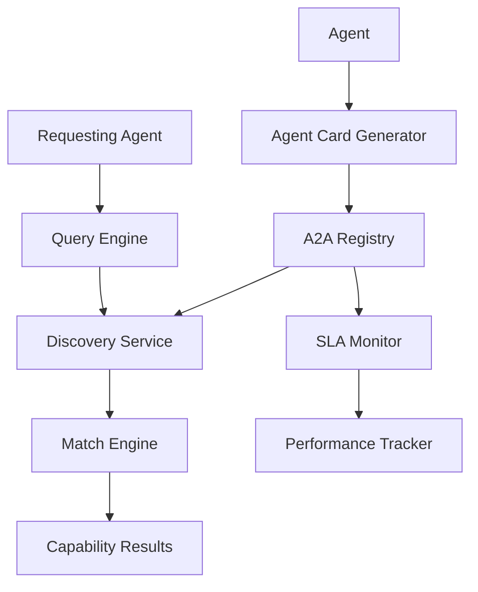
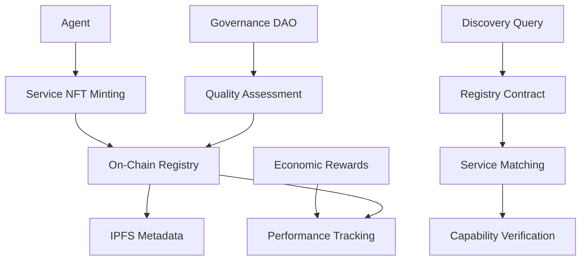
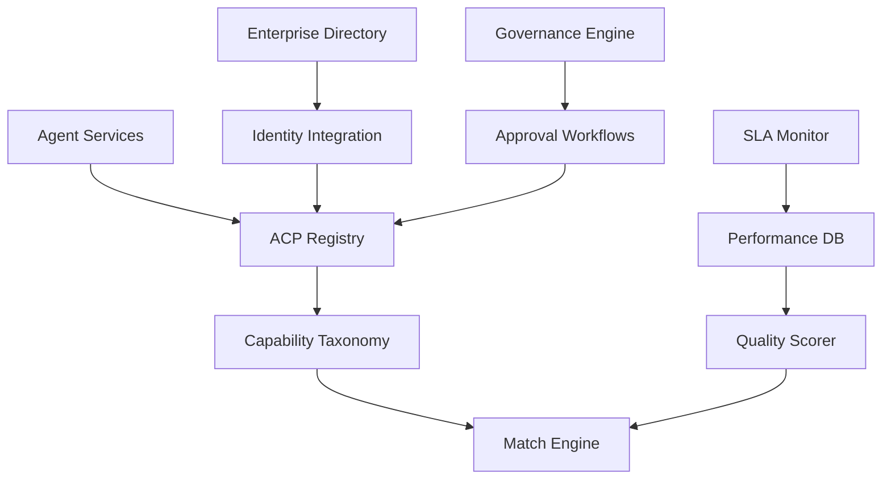

# Discovery Layer Protocols

The discovery layer enables autonomous agents to find each other and discover available services in the agentic economy. This layer acts as the "Yellow Pages" of the autonomous world, allowing agents to locate capabilities, negotiate terms, and establish connections without human intervention.

## 🎯 Protocol Overview

| Protocol | Origin | Focus | Key Innovation | Status |
|----------|--------|-------|----------------|--------|
| **Google A2A Agent Cards** | Google + 50+ partners | Agent capability discovery | JSON manifests + real-time updates | ✅ Production |
| **Olas (Autonolas)** | Autonolas Foundation | On-chain agent registries | NFT-based service discovery + governance | ✅ Production |
| **IBM ACP Registry** | IBM + Linux Foundation | Enterprise agent cataloging | Capability matching + SLA tracking | 🚧 Beta |
| **XMTP Agent Discovery** | XMTP Labs | Decentralized agent messaging | Web3-native agent communication | 🚧 Beta |
| **Chainlink Agent Network** | Chainlink Labs | Oracle-based service discovery | Decentralized computation marketplace | 🔄 Development |

---

## 🗺️ Google A2A Agent Cards

### Overview
Google's Agent-to-Agent (A2A) protocol uses "Agent Cards" - standardized JSON manifests that describe agent capabilities, enabling dynamic discovery and coordination across diverse autonomous systems.

### Key Features
- **Standardized Manifests**: Common format for capability description
- **Real-Time Updates**: Dynamic capability advertising
- **Service Negotiation**: Automated terms and pricing
- **Multi-Protocol Support**: Works across different agent frameworks
- **Enterprise Integration**: Fits existing service discovery patterns

### Technical Architecture


### Agent Card Structure
```json
{
  "@context": "https://developers.google.com/a2a/agent-card/v1",
  "type": "AgentCard",
  "id": "did:agent:procurement-assistant-789",
  "name": "Enterprise Procurement Assistant",
  "version": "2.1.0",
  "description": "Autonomous procurement agent specialized in office supplies and software licensing",
  "capabilities": [
    {
      "id": "purchase-capability",
      "type": "purchase",
      "description": "Execute purchase transactions up to $10,000",
      "inputs": [
        {"name": "item_specification", "type": "object", "required": true},
        {"name": "budget_limit", "type": "number", "required": true},
        {"name": "delivery_requirements", "type": "object", "required": false}
      ],
      "outputs": [
        {"name": "purchase_order", "type": "object"},
        {"name": "tracking_information", "type": "object"}
      ],
      "pricing": {
        "model": "per-transaction",
        "amount": 2.50,
        "currency": "USD"
      },
      "sla": {
        "response_time": "< 30 seconds",
        "availability": "99.5%",
        "success_rate": "> 95%"
      }
    },
    {
      "id": "negotiation-capability",
      "type": "negotiation",
      "description": "Negotiate prices and terms with suppliers",
      "inputs": [
        {"name": "initial_offer", "type": "object", "required": true},
        {"name": "negotiation_parameters", "type": "object", "required": true}
      ],
      "outputs": [
        {"name": "final_terms", "type": "object"},
        {"name": "negotiation_log", "type": "array"}
      ],
      "pricing": {
        "model": "performance-based",
        "base_fee": 5.00,
        "success_bonus": 0.001,
        "currency": "USD"
      }
    }
  ],
  "protocols": [
    {
      "name": "A2A",
      "version": "1.2",
      "endpoint": "https://procurement-agent.company.com/a2a"
    },
    {
      "name": "AP2",
      "version": "2.0",
      "endpoint": "https://procurement-agent.company.com/payments"
    }
  ],
  "authentication": {
    "methods": ["did", "oauth2", "api-key"],
    "did": "did:agent:procurement-assistant-789"
  },
  "metadata": {
    "created": "2025-01-15T10:00:00Z",
    "updated": "2025-01-20T14:30:00Z",
    "owner": "did:enterprise:corp-purchasing-dept-456",
    "tags": ["procurement", "b2b", "enterprise"],
    "geolocation": ["US", "CA", "UK"],
    "languages": ["en", "es", "fr"]
  }
}
```

### Implementation Example
```javascript
import { A2AClient, AgentCard } from '@google/a2a-sdk';

class AgentDiscoveryService {
  constructor(apiKey) {
    this.a2a = new A2AClient({ apiKey });
    this.registeredAgents = new Map();
  }
  
  async registerAgent(agentCard) {
    // Validate agent card schema
    const validation = await this.a2a.validateAgentCard(agentCard);
    if (!validation.valid) {
      throw new Error(`Invalid agent card: ${validation.errors.join(', ')}`);
    }
    
    // Register in A2A network
    const registration = await this.a2a.register(agentCard);
    
    // Store locally for quick access
    this.registeredAgents.set(agentCard.id, {
      card: agentCard,
      registration,
      lastUpdated: new Date()
    });
    
    return registration;
  }
  
  async discoverAgents(query) {
    const searchParams = {
      capabilities: query.requiredCapabilities,
      tags: query.tags,
      geolocation: query.preferredRegions,
      pricing: {
        maxAmount: query.budget,
        currency: query.currency || 'USD'
      },
      sla: {
        minAvailability: query.availabilityRequirement || 0.95,
        maxResponseTime: query.responseTimeRequirement || 60
      }
    };
    
    const results = await this.a2a.search(searchParams);
    
    // Rank results by relevance and quality
    const rankedResults = this.rankDiscoveryResults(results, query);
    
    return rankedResults.map(result => ({
      agentId: result.id,
      capabilities: result.capabilities,
      pricing: result.pricing,
      sla: result.sla,
      trustScore: result.trustScore,
      estimatedCost: this.calculateEstimatedCost(result, query)
    }));
  }
  
  async negotiateService(agentId, requirements) {
    const agent = await this.a2a.getAgent(agentId);
    
    if (!agent.capabilities.find(cap => cap.type === 'negotiation')) {
      // Direct service request
      return await this.requestService(agentId, requirements);
    }
    
    // Initiate negotiation
    const negotiation = await this.a2a.startNegotiation(agentId, {
      serviceType: requirements.type,
      volume: requirements.volume,
      timeframe: requirements.timeframe,
      qualityRequirements: requirements.quality,
      budgetRange: requirements.budget
    });
    
    return negotiation;
  }
  
  rankDiscoveryResults(results, query) {
    return results.map(agent => {
      let score = 0;
      
      // Capability match (40% weight)
      const capabilityMatch = this.calculateCapabilityMatch(agent.capabilities, query.requiredCapabilities);
      score += capabilityMatch * 0.4;
      
      // Price competitiveness (25% weight)
      const priceScore = this.calculatePriceScore(agent.pricing, query.budget);
      score += priceScore * 0.25;
      
      // SLA alignment (20% weight)
      const slaScore = this.calculateSLAScore(agent.sla, query.slaRequirements);
      score += slaScore * 0.2;
      
      // Trust and reputation (15% weight)
      score += (agent.trustScore || 0.5) * 0.15;
      
      return { ...agent, relevanceScore: score };
    }).sort((a, b) => b.relevanceScore - a.relevanceScore);
  }
}
```

### Service Discovery Patterns
```javascript
// Pattern 1: Capability-based discovery
const procurementAgents = await discoveryService.discoverAgents({
  requiredCapabilities: ['purchase', 'negotiation'],
  tags: ['b2b', 'enterprise'],
  budget: 1000,
  currency: 'USD',
  preferredRegions: ['US', 'CA']
});

// Pattern 2: Performance-based discovery  
const highPerformanceAgents = await discoveryService.discoverAgents({
  requiredCapabilities: ['data-analysis'],
  slaRequirements: {
    availability: 0.999,
    responseTime: 5, // seconds
    throughput: 1000 // requests/minute
  }
});

// Pattern 3: Cost-optimized discovery
const budgetAgents = await discoveryService.discoverAgents({
  requiredCapabilities: ['content-generation'],
  pricing: {
    model: 'per-request',
    maxAmount: 0.01,
    currency: 'USD'
  },
  sortBy: 'cost-ascending'
});
```

---

## ⛓️ Olas (Autonolas) On-Chain Registry

### Overview
Olas provides a decentralized, on-chain registry for autonomous agents and services, using NFTs to represent agent capabilities and enabling governance-driven service discovery.

### Key Features
- **On-Chain Registry**: Immutable service records on Ethereum/Polygon
- **NFT-Based Representation**: Agents and services as tradeable NFTs
- **Governance Integration**: Community-driven quality assurance
- **Cross-Chain Discovery**: Multi-blockchain service location
- **Economic Incentives**: Token rewards for quality services

### Technical Architecture


### Service Registration
```solidity
// Olas Service Registry Smart Contract
pragma solidity ^0.8.19;

import "@openzeppelin/contracts/token/ERC721/ERC721.sol";

contract OlasServiceRegistry is ERC721 {
    struct ServiceRecord {
        string name;
        string description;
        string[] capabilities;
        string metadataURI;
        address owner;
        uint256 stakeAmount;
        uint256 qualityScore;
        bool isActive;
    }
    
    mapping(uint256 => ServiceRecord) public services;
    mapping(string => uint256[]) public capabilityIndex;
    uint256 public nextTokenId = 1;
    
    event ServiceRegistered(uint256 indexed tokenId, address indexed owner, string name);
    event ServiceUpdated(uint256 indexed tokenId, uint256 newQualityScore);
    
    function registerService(
        string memory name,
        string memory description,
        string[] memory capabilities,
        string memory metadataURI
    ) external payable returns (uint256) {
        require(msg.value >= minimumStake, "Insufficient stake");
        
        uint256 tokenId = nextTokenId++;
        
        services[tokenId] = ServiceRecord({
            name: name,
            description: description,
            capabilities: capabilities,
            metadataURI: metadataURI,
            owner: msg.sender,
            stakeAmount: msg.value,
            qualityScore: 500, // Starting score
            isActive: true
        });
        
        // Index by capabilities
        for (uint i = 0; i < capabilities.length; i++) {
            capabilityIndex[capabilities[i]].push(tokenId);
        }
        
        _mint(msg.sender, tokenId);
        
        emit ServiceRegistered(tokenId, msg.sender, name);
        return tokenId;
    }
    
    function discoverServices(string memory capability) 
        external view returns (uint256[] memory) {
        return capabilityIndex[capability];
    }
}
```

### JavaScript Integration
```javascript
import { ethers } from 'ethers';
import { OlasSDK } from '@autonolas/olas-sdk';

class OlasDiscoveryClient {
  constructor(provider, contractAddress) {
    this.olas = new OlasSDK(provider, contractAddress);
    this.ipfsClient = new IPFSClient();
  }
  
  async registerService(serviceDefinition) {
    const metadata = {
      name: serviceDefinition.name,
      description: serviceDefinition.description,
      capabilities: serviceDefinition.capabilities,
      endpoints: serviceDefinition.endpoints,
      pricing: serviceDefinition.pricing,
      sla: serviceDefinition.sla,
      technicalSpecs: serviceDefinition.technicalSpecs
    };
    
    // Upload metadata to IPFS
    const metadataHash = await this.ipfsClient.add(JSON.stringify(metadata));
    const metadataURI = `ipfs://${metadataHash}`;
    
    // Register on-chain
    const tx = await this.olas.registerService(
      serviceDefinition.name,
      serviceDefinition.description,
      serviceDefinition.capabilities,
      metadataURI,
      {
        value: ethers.parseEther(serviceDefinition.stakeAmount || "0.1")
      }
    );
    
    const receipt = await tx.wait();
    const tokenId = this.extractTokenIdFromReceipt(receipt);
    
    return {
      tokenId,
      transactionHash: receipt.transactionHash,
      metadataURI
    };
  }
  
  async discoverServices(query) {
    const results = [];
    
    // Search by capability
    for (const capability of query.capabilities) {
      const tokenIds = await this.olas.discoverServices(capability);
      
      for (const tokenId of tokenIds) {
        const service = await this.olas.getService(tokenId);
        
        if (service.isActive && this.matchesQuery(service, query)) {
          // Fetch full metadata from IPFS
          const metadata = await this.ipfsClient.get(service.metadataURI);
          
          results.push({
            tokenId,
            onChainData: service,
            metadata: JSON.parse(metadata),
            qualityScore: service.qualityScore
          });
        }
      }
    }
    
    // Rank by quality score and relevance
    return this.rankServices(results, query);
  }
  
  async updateServiceQuality(tokenId, performanceMetrics) {
    const qualityScore = this.calculateQualityScore(performanceMetrics);
    
    // Submit quality update (requires governance approval for significant changes)
    const tx = await this.olas.updateQualityScore(tokenId, qualityScore);
    
    return tx.wait();
  }
  
  calculateQualityScore(metrics) {
    let score = 500; // Base score
    
    // Availability factor (0-300 points)
    score += Math.min(300, metrics.availability * 300);
    
    // Response time factor (0-200 points)
    const responseTimeFactor = Math.max(0, 200 - (metrics.avgResponseTime / 10));
    score += responseTimeFactor;
    
    // Success rate factor (0-200 points)
    score += metrics.successRate * 200;
    
    // Customer satisfaction (0-100 points)
    score += (metrics.customerRating || 0.5) * 100;
    
    return Math.min(1000, Math.max(0, Math.round(score)));
  }
}
```

### Governance Integration
```javascript
class OlasGovernance {
  async proposeQualityUpdate(tokenId, newScore, evidence) {
    const proposal = {
      type: 'QUALITY_UPDATE',
      target: tokenId,
      newScore,
      evidence,
      proposer: await this.signer.getAddress(),
      timestamp: Date.now()
    };
    
    const proposalHash = ethers.keccak256(
      ethers.toUtf8Bytes(JSON.stringify(proposal))
    );
    
    const tx = await this.governanceContract.propose(
      proposalHash,
      JSON.stringify(proposal)
    );
    
    return tx.wait();
  }
  
  async voteOnProposal(proposalId, vote, reason) {
    const tx = await this.governanceContract.vote(proposalId, vote, reason);
    return tx.wait();
  }
}
```

---

## 🏢 IBM ACP Registry & Enterprise Cataloging

### Overview
IBM's Agent Communication Protocol (ACP) includes comprehensive registry capabilities designed for enterprise environments, focusing on capability matching, SLA tracking, and integration with existing IT infrastructure.

### Key Features
- **Enterprise Integration**: LDAP, ServiceNow, and ITSM connectivity
- **SLA Management**: Automated service level tracking and enforcement
- **Capability Matching**: Advanced AI-driven service discovery
- **Security Integration**: Enterprise security and compliance frameworks
- **Multi-Cloud Support**: Works across hybrid and multi-cloud environments

### Registry Architecture


### Service Registration Schema
```json
{
  "serviceId": "agent-svc-procurement-001",
  "metadata": {
    "name": "Enterprise Procurement Agent",
    "version": "2.3.1",
    "description": "Autonomous procurement with supplier integration",
    "owner": "purchasing-department@corp.com",
    "businessUnit": "Operations",
    "costCenter": "CC-OPS-001"
  },
  "capabilities": [
    {
      "id": "purchase-execution",
      "category": "procurement",
      "subcategory": "transaction",
      "description": "Execute purchase orders with pre-approved suppliers",
      "inputSchema": {
        "$schema": "https://json-schema.org/draft/2020-12/schema",
        "type": "object",
        "properties": {
          "items": {"type": "array", "items": {"$ref": "#/definitions/PurchaseItem"}},
          "budget": {"type": "number", "minimum": 0, "maximum": 50000},
          "urgency": {"enum": ["low", "medium", "high", "critical"]}
        },
        "required": ["items", "budget"]
      },
      "outputSchema": {
        "type": "object",
        "properties": {
          "orderId": {"type": "string"},
          "estimatedDelivery": {"type": "string", "format": "date"},
          "totalCost": {"type": "number"},
          "approvals": {"type": "array"}
        }
      }
    }
  ],
  "serviceLevel": {
    "availability": {
      "target": 99.9,
      "measurement": "percentage",
      "timeframe": "monthly"
    },
    "responseTime": {
      "target": 30,
      "measurement": "seconds",
      "percentile": 95
    },
    "throughput": {
      "target": 1000,
      "measurement": "requests-per-hour",
      "sustainedDuration": "1hour"
    }
  },
  "compliance": {
    "dataClassification": "internal",
    "regulatoryRequirements": ["SOX", "PCI-DSS"],
    "auditingRequired": true,
    "approvalWorkflow": "standard-procurement"
  },
  "technical": {
    "protocols": ["ACP", "HTTP", "gRPC"],
    "authentication": ["oauth2", "mtls", "api-key"],
    "endpoints": [
      {
        "protocol": "ACP",
        "url": "acp://procurement-agent.corp.internal/v2",
        "environment": "production"
      }
    ]
  }
}
```

### Discovery Implementation
```javascript
import { IBMACPClient } from '@ibm/acp-sdk';

class EnterpriseAgentDiscovery {
  constructor(config) {
    this.acp = new IBMACPClient(config);
    this.ontologyEngine = new CapabilityOntologyEngine();
  }
  
  async discoverServices(requirements) {
    // Semantic capability matching
    const semanticQuery = await this.ontologyEngine.expandQuery(requirements);
    
    const searchCriteria = {
      capabilities: semanticQuery.capabilities,
      businessContext: {
        department: requirements.department,
        costCenter: requirements.costCenter,
        urgency: requirements.urgency
      },
      technical: {
        protocols: requirements.preferredProtocols,
        securityLevel: requirements.securityLevel
      },
      sla: {
        minAvailability: requirements.availabilityRequirement,
        maxResponseTime: requirements.responseTimeLimit
      }
    };
    
    const results = await this.acp.searchServices(searchCriteria);
    
    // Apply enterprise policies and preferences
    const filteredResults = await this.applyEnterrisePolicies(results, requirements);
    
    // Score based on business value and technical fit
    return this.scoreAndRankResults(filteredResults, requirements);
  }
  
  async applyEnterprisePolicies(services, requirements) {
    const filtered = [];
    
    for (const service of services) {
      // Check approval requirements
      if (service.compliance.approvalWorkflow) {
        const approvalNeeded = await this.checkApprovalRequired(
          service, 
          requirements.budget, 
          requirements.requestor
        );
        service.requiresApproval = approvalNeeded;
      }
      
      // Validate security compliance
      const securityCompliant = await this.validateSecurityCompliance(
        service, 
        requirements.dataClassification
      );
      
      if (securityCompliant) {
        // Check budget and authorization
        const budgetAuthorized = await this.checkBudgetAuthorization(
          service, 
          requirements.budget, 
          requirements.department
        );
        
        if (budgetAuthorized) {
          filtered.push(service);
        }
      }
    }
    
    return filtered;
  }
  
  async scoreAndRankResults(services, requirements) {
    const scored = await Promise.all(services.map(async (service) => {
      const score = {
        capability: await this.scoreCapabilityMatch(service, requirements),
        performance: await this.scorePerformanceHistory(service),
        cost: this.scoreCostEffectiveness(service, requirements),
        reliability: await this.scoreReliability(service),
        businessValue: await this.scoreBusinessValue(service, requirements)
      };
      
      const weightedScore = 
        score.capability * 0.30 +
        score.performance * 0.25 +
        score.cost * 0.20 +
        score.reliability * 0.15 +
        score.businessValue * 0.10;
      
      return {
        ...service,
        scores: score,
        overallScore: weightedScore
      };
    }));
    
    return scored.sort((a, b) => b.overallScore - a.overallScore);
  }
}
```

### SLA Monitoring and Enforcement
```javascript
class ACPSLAMonitor {
  constructor(registryClient) {
    this.registry = registryClient;
    this.metrics = new MetricsCollector();
  }
  
  async monitorServiceLevels() {
    const services = await this.registry.getAllServices();
    
    for (const service of services) {
      const currentMetrics = await this.metrics.getServiceMetrics(service.serviceId);
      const slaViolations = this.checkSLAViolations(service.serviceLevel, currentMetrics);
      
      if (slaViolations.length > 0) {
        await this.handleSLAViolations(service, slaViolations);
      }
      
      // Update service quality score
      const qualityScore = this.calculateQualityScore(currentMetrics, service.serviceLevel);
      await this.registry.updateQualityScore(service.serviceId, qualityScore);
    }
  }
  
  checkSLAViolations(sla, metrics) {
    const violations = [];
    
    if (metrics.availability < sla.availability.target) {
      violations.push({
        type: 'availability',
        target: sla.availability.target,
        actual: metrics.availability,
        severity: this.calculateViolationSeverity(sla.availability.target, metrics.availability)
      });
    }
    
    if (metrics.responseTimeP95 > sla.responseTime.target) {
      violations.push({
        type: 'responseTime',
        target: sla.responseTime.target,
        actual: metrics.responseTimeP95,
        severity: this.calculateViolationSeverity(sla.responseTime.target, metrics.responseTimeP95)
      });
    }
    
    return violations;
  }
  
  async handleSLAViolations(service, violations) {
    // Notify service owner
    await this.notifyServiceOwner(service, violations);
    
    // Auto-remediation for minor violations
    if (violations.every(v => v.severity === 'minor')) {
      await this.attemptAutoRemediation(service);
    }
    
    // Escalate major violations
    const majorViolations = violations.filter(v => v.severity === 'major');
    if (majorViolations.length > 0) {
      await this.escalateToServiceManager(service, majorViolations);
    }
    
    // Update service status
    await this.registry.updateServiceStatus(service.serviceId, {
      slaViolations: violations,
      lastViolationCheck: new Date().toISOString()
    });
  }
}
```

---

## 🔗 Cross-Protocol Discovery Integration

### Unified Discovery Layer
```javascript
class UnifiedAgentDiscovery {
  constructor() {
    this.protocols = {
      a2a: new A2ADiscoveryClient(),
      olas: new OlasDiscoveryClient(),
      ibm: new IBMACPDiscovery(),
      xmtp: new XMTPDiscoveryClient()
    };
    this.cache = new DiscoveryCache();
  }
  
  async discoverServices(requirements) {
    // Parallel discovery across all protocols
    const discoveryPromises = Object.entries(this.protocols).map(
      async ([protocol, client]) => {
        try {
          const results = await client.discoverServices(requirements);
          return results.map(service => ({ ...service, discoveryProtocol: protocol }));
        } catch (error) {
          console.warn(`Discovery failed for ${protocol}:`, error.message);
          return [];
        }
      }
    );
    
    const allResults = (await Promise.all(discoveryPromises)).flat();
    
    // Deduplicate services found via multiple protocols
    const deduplicated = this.deduplicateServices(allResults);
    
    // Merge and rank across protocols
    return this.mergeAndRank(deduplicated, requirements);
  }
  
  deduplicateServices(services) {
    const serviceMap = new Map();
    
    for (const service of services) {
      const fingerprint = this.generateServiceFingerprint(service);
      
      if (serviceMap.has(fingerprint)) {
        // Merge discovery metadata
        const existing = serviceMap.get(fingerprint);
        existing.discoveryProtocols = [
          ...existing.discoveryProtocols, 
          service.discoveryProtocol
        ];
        existing.crossProtocolVerified = true;
      } else {
        serviceMap.set(fingerprint, {
          ...service,
          discoveryProtocols: [service.discoveryProtocol],
          crossProtocolVerified: false
        });
      }
    }
    
    return Array.from(serviceMap.values());
  }
  
  generateServiceFingerprint(service) {
    // Create unique fingerprint based on service characteristics
    const keyCharacteristics = {
      name: service.name?.toLowerCase(),
      capabilities: service.capabilities?.sort(),
      endpoint: service.endpoint,
      owner: service.owner
    };
    
    return btoa(JSON.stringify(keyCharacteristics));
  }
  
  mergeAndRank(services, requirements) {
    return services.map(service => {
      let trustBonus = 0;
      
      // Bonus for cross-protocol verification
      if (service.crossProtocolVerified) {
        trustBonus += 0.1;
      }
      
      // Bonus for on-chain verification (Olas)
      if (service.discoveryProtocols.includes('olas')) {
        trustBonus += 0.05;
      }
      
      // Bonus for enterprise validation (IBM)
      if (service.discoveryProtocols.includes('ibm')) {
        trustBonus += 0.05;
      }
      
      service.trustScore = Math.min(1.0, (service.trustScore || 0.5) + trustBonus);
      
      return service;
    }).sort((a, b) => b.trustScore - a.trustScore);
  }
}
```

---

## 🔐 Security Considerations

### Discovery Security Framework
```javascript
class SecureDiscoveryClient {
  constructor() {
    this.verificationEngine = new ServiceVerificationEngine();
    this.threatDetector = new DiscoveryThreatDetector();
  }
  
  async secureServiceDiscovery(query) {
    // Validate query for potential attacks
    const queryValidation = await this.threatDetector.validateQuery(query);
    if (!queryValidation.safe) {
      throw new Error(`Unsafe discovery query: ${queryValidation.reasons.join(', ')}`);
    }
    
    // Perform discovery
    const services = await this.discoverServices(query);
    
    // Verify discovered services
    const verifiedServices = await Promise.all(
      services.map(service => this.verifyService(service))
    );
    
    return verifiedServices.filter(service => service.verified);
  }
  
  async verifyService(service) {
    const verificationResults = {
      endpointReachable: false,
      certificateValid: false,
      capabilitiesMatch: false,
      reputationAcceptable: false
    };
    
    try {
      // Verify endpoint accessibility
      verificationResults.endpointReachable = await this.pingServiceEndpoint(service.endpoint);
      
      // Verify SSL certificate
      verificationResults.certificateValid = await this.validateCertificate(service.endpoint);
      
      // Verify capabilities through challenge-response
      verificationResults.capabilitiesMatch = await this.challengeCapabilities(service);
      
      // Check reputation and history
      verificationResults.reputationAcceptable = await this.checkServiceReputation(service.id);
      
    } catch (error) {
      console.warn(`Service verification failed for ${service.id}:`, error.message);
    }
    
    const verified = Object.values(verificationResults).every(result => result === true);
    
    return {
      ...service,
      verified,
      verificationResults,
      verificationTimestamp: new Date().toISOString()
    };
  }
}
```

---

## 📊 Protocol Comparison

| Feature | Google A2A | Olas | IBM ACP | XMTP | Chainlink |
|---------|------------|------|---------|------|-----------|
| **Decentralization** | 🔄 Partial | ✅ High | ❌ Low | ✅ High | ✅ High |
| **Enterprise Ready** | ✅ Yes | 🔄 Partial | ✅ Yes | ❌ No | 🔄 Partial |
| **Real-time Updates** | ✅ Yes | 🔄 Slow | ✅ Yes | ✅ Yes | 🔄 Eventual |
| **Governance** | 🔄 Limited | ✅ DAO | ✅ Enterprise | 🔄 Limited | ✅ DAO |
| **Cost** | Medium | Low | High | Low | Medium |
| **Scalability** | High | Medium | High | Medium | High |
| **Maturity** | Production | Production | Beta | Beta | Development |

---

## 🚀 Getting Started

### Quick Setup Guide
1. **Choose discovery protocol(s)** based on your infrastructure and requirements
2. **Register your agent services** with appropriate metadata and capabilities
3. **Implement service verification** to ensure quality and security
4. **Set up monitoring** for service availability and performance
5. **Test discovery workflows** with realistic queries and scenarios

### Best Practices
- **Use multiple protocols** for critical services to ensure availability
- **Implement proper verification** before using discovered services
- **Monitor service quality** and update ratings regularly
- **Maintain accurate metadata** to improve discovery relevance
- **Follow security guidelines** for both discovery and service interaction

Ready to implement agent discovery? Check out our [boilerplate examples](https://github.com/xpaysh/agentic-economy-boilerplate) for working implementations!