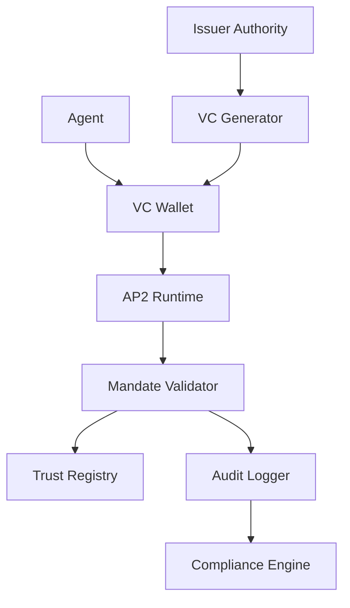

# Identity & Trust Layer Protocols

The identity and trust layer is the foundation of the agentic economy. Before agents can discover services, communicate, or transact, they must establish who they are and who they can trust. This layer enables autonomous agents to prove their identity, verify credentials, and establish trust relationships without human intervention.

## 🎯 Protocol Overview

| Protocol | Origin | Focus | Key Innovation | Status |
|----------|--------|-------|----------------|--------|
| **Google AP2 Mandates** | Google + 60+ partners | Agent authorization via VCs | Verifiable credentials + audit trails | ✅ Production |
| **Visa Trusted Agent Protocol (TAP)** | Visa + Cloudflare | Agent vs bot verification | Real-time fraud detection + identity | 🚧 Beta |
| **W3C DIDs/VCs** | W3C Standards | Decentralized identity foundation | Self-sovereign identity for agents | ✅ Standard |
| **Mastercard "Know Your Agent"** | Mastercard | TradFi-to-agent identity bridge | Card network integration + compliance | 🚧 Pilot |
| **IBM Agent Identity Framework** | IBM | Enterprise agent identity | Corporate identity integration | 🔄 Development |

---

## 🔐 Google AP2 Mandates & Verifiable Credentials

### Overview
Google's Agent Payments Protocol (AP2) uses Verifiable Credentials (VCs) as the core trust mechanism for agent authorization. This enables enterprises to grant specific spending authorities to AI agents while maintaining full audit trails and compliance.

### Key Features
- **Verifiable Credentials**: W3C standard digital credentials for agents
- **Mandate-Based Authorization**: Pre-approved spending limits and conditions
- **Immutable Audit Trails**: All authorization decisions logged permanently
- **Multi-Party Verification**: Cross-organizational trust networks
- **Revocation Management**: Real-time credential revocation

### Technical Architecture


### Credential Types

#### 1. **Agent Identity Credentials**
```json
{
  "@context": ["https://www.w3.org/2018/credentials/v1"],
  "type": ["VerifiableCredential", "AgentIdentityCredential"],
  "issuer": "did:example:corp-issuer-123",
  "issuanceDate": "2025-01-01T00:00:00Z",
  "credentialSubject": {
    "id": "did:agent:ai-assistant-456",
    "agentType": "procurement-assistant",
    "capabilities": ["purchase", "negotiate", "audit"],
    "maxTransactionValue": 10000,
    "operatingRegions": ["US", "EU", "APAC"]
  }
}
```

#### 2. **Mandate Credentials**
```json
{
  "@context": ["https://www.w3.org/2018/credentials/v1"],
  "type": ["VerifiableCredential", "PurchaseMandateCredential"],
  "issuer": "did:example:enterprise-789",
  "credentialSubject": {
    "id": "did:agent:ai-assistant-456",
    "mandateType": "recurring-purchase",
    "validUntil": "2025-12-31T23:59:59Z",
    "spendingLimits": {
      "daily": 1000,
      "monthly": 25000,
      "perTransaction": 500
    },
    "approvedCategories": ["office-supplies", "software-licenses"]
  }
}
```

### Implementation Example
```javascript
import { AP2Agent, VerifiableCredential } from '@google/ap2-sdk';

const agent = new AP2Agent({
  did: 'did:agent:procurement-bot-123',
  privateKey: process.env.AGENT_PRIVATE_KEY,
  trustRegistry: 'https://trust.enterprise.com'
});

// Load agent credentials
const identityVC = await VerifiableCredential.load('./identity-credential.json');
const mandateVC = await VerifiableCredential.load('./purchase-mandate.json');

agent.addCredentials([identityVC, mandateVC]);

// Verify authorization for purchase
const purchaseRequest = {
  amount: 250.00,
  category: 'office-supplies',
  vendor: 'did:vendor:office-depot-456'
};

const isAuthorized = await agent.verifyAuthorization(purchaseRequest);
if (isAuthorized) {
  const transaction = await agent.executePurchase(purchaseRequest);
  console.log('Purchase completed:', transaction.id);
}
```

### Enterprise Integration
```javascript
// Corporate credential issuance
class CorporateCredentialIssuer {
  constructor(corporateDID, signingKey) {
    this.issuer = corporateDID;
    this.signingKey = signingKey;
  }
  
  async issueAgentCredential(agentDID, capabilities) {
    const credential = {
      '@context': ['https://www.w3.org/2018/credentials/v1'],
      type: ['VerifiableCredential', 'AgentIdentityCredential'],
      issuer: this.issuer,
      issuanceDate: new Date().toISOString(),
      credentialSubject: {
        id: agentDID,
        capabilities,
        issuedBy: this.issuer,
        complianceLevel: 'enterprise'
      }
    };
    
    // Sign credential
    const signedCredential = await this.signCredential(credential);
    
    // Register in trust registry
    await this.registerInTrustRegistry(signedCredential);
    
    return signedCredential;
  }
}
```

---

## 🛡️ Visa Trusted Agent Protocol (TAP)

### Overview
Visa's Trusted Agent Protocol (TAP), developed in partnership with Cloudflare, focuses on distinguishing legitimate AI agents from malicious bots through advanced verification mechanisms.

### Key Features
- **Real-Time Bot Detection**: Advanced behavioral analysis
- **Cloudflare Integration**: Edge-based verification
- **Risk Scoring**: Dynamic trust levels based on behavior
- **Global Network**: Leverages Visa's worldwide infrastructure
- **Fraud Prevention**: Proactive threat detection

### Technical Components

#### 1. **Agent Attestation**
```http
POST /tap/v1/attest
Authorization: Bearer TAP-Token-xyz
Content-Type: application/json

{
  "agentId": "agent-procurement-123",
  "publicKey": "-----BEGIN PUBLIC KEY-----...",
  "capabilities": ["payment", "negotiation"],
  "operatingContext": {
    "organizationId": "enterprise-corp-456",
    "geolocation": "US-WEST",
    "networkFingerprint": "cf-ray-789abc"
  }
}
```

#### 2. **Trust Score Verification**
```javascript
import { TAPClient } from '@visa/tap-sdk';

const tapClient = new TAPClient({
  apiKey: process.env.TAP_API_KEY,
  network: 'production'
});

async function verifyAgentTrust(agentId, transactionContext) {
  const trustScore = await tapClient.getTrustScore(agentId, {
    transactionAmount: transactionContext.amount,
    merchantCategory: transactionContext.category,
    geolocation: transactionContext.location,
    timeOfDay: new Date().getHours()
  });
  
  // Trust levels: HIGH (0.8-1.0), MEDIUM (0.5-0.8), LOW (0.0-0.5)
  return {
    score: trustScore.value,
    level: trustScore.level,
    factors: trustScore.contributingFactors,
    recommendations: trustScore.recommendations
  };
}
```

### Behavioral Analysis
```javascript
// Real-time behavior monitoring
const behaviorMonitor = {
  trackInteraction: async (agentId, action, context) => {
    const behaviorSignal = {
      timestamp: Date.now(),
      agentId,
      actionType: action.type,
      responseTime: action.responseTime,
      decisionPattern: action.pattern,
      contextualFactors: context
    };
    
    // Send to Cloudflare edge for analysis
    await tapClient.recordBehavior(behaviorSignal);
  },
  
  detectAnomalies: async (agentId) => {
    const baseline = await tapClient.getBaselineBehavior(agentId);
    const recent = await tapClient.getRecentBehavior(agentId);
    
    const anomalyScore = calculateDeviationScore(baseline, recent);
    
    if (anomalyScore > 0.7) {
      await tapClient.flagForReview(agentId, {
        anomalyScore,
        reason: 'behavioral_deviation',
        details: recent
      });
    }
    
    return anomalyScore;
  }
};
```

---

## 🌐 W3C Decentralized Identifiers (DIDs) & Verifiable Credentials

### Overview
W3C's DID and VC standards provide the foundational infrastructure for self-sovereign identity in the agentic economy. These enable agents to have persistent, verifiable identities without relying on centralized authorities.

### Key Features
- **Self-Sovereign Identity**: Agents control their own identity
- **Interoperability**: Works across different systems and protocols
- **Cryptographic Verification**: Strong security guarantees
- **Privacy Preservation**: Selective disclosure capabilities
- **Decentralized**: No single point of failure

### DID Methods for Agents

#### 1. **did:agent Method**
```
did:agent:1234567890abcdef1234567890abcdef12345678
```

#### 2. **DID Document Structure**
```json
{
  "@context": "https://www.w3.org/ns/did/v1",
  "id": "did:agent:1234567890abcdef1234567890abcdef12345678",
  "verificationMethod": [{
    "id": "did:agent:123...#keys-1",
    "type": "Ed25519VerificationKey2018",
    "controller": "did:agent:123...",
    "publicKeyBase58": "H3C2AVvLMv6gmMNam3uVAjZpfkcJCwDwnZn6z3wXmqPV"
  }],
  "authentication": ["did:agent:123...#keys-1"],
  "service": [{
    "id": "did:agent:123...#agent-endpoint",
    "type": "AgentService",
    "serviceEndpoint": "https://agent.example.com/api"
  }]
}
```

### Implementation Example
```javascript
import { DIDAgent, VerifiableCredential } from '@w3c/did-agent';

class AutonomousAgent {
  constructor() {
    this.did = null;
    this.credentials = new Map();
  }
  
  async initialize() {
    // Generate DID and keys
    this.did = await DIDAgent.create({
      method: 'agent',
      network: 'mainnet'
    });
    
    // Publish DID document
    await this.did.publish();
    
    console.log(`Agent initialized with DID: ${this.did.id}`);
  }
  
  async requestCredential(issuerDID, credentialType, claims) {
    const request = {
      issuer: issuerDID,
      subject: this.did.id,
      type: credentialType,
      claims
    };
    
    // Create proof of identity for request
    const signedRequest = await this.did.sign(request);
    
    // Submit to issuer
    const credential = await this.submitCredentialRequest(signedRequest);
    
    // Verify and store credential
    if (await credential.verify()) {
      this.credentials.set(credentialType, credential);
      return credential;
    }
    
    throw new Error('Invalid credential received');
  }
  
  async presentCredential(verifierDID, credentialTypes) {
    const presentation = {
      '@context': ['https://www.w3.org/2018/credentials/v1'],
      type: ['VerifiablePresentation'],
      holder: this.did.id,
      verifiableCredential: []
    };
    
    // Add requested credentials
    for (const type of credentialTypes) {
      const credential = this.credentials.get(type);
      if (credential) {
        presentation.verifiableCredential.push(credential);
      }
    }
    
    // Sign presentation
    const signedPresentation = await this.did.sign(presentation);
    
    return signedPresentation;
  }
}
```

---

## 💳 Mastercard "Know Your Agent" Framework

### Overview
Mastercard's "Know Your Agent" framework extends traditional KYC (Know Your Customer) principles to AI agents, enabling integration with existing financial infrastructure while maintaining compliance standards.

### Key Features
- **Agent KYC**: Identity verification for AI agents
- **Compliance Integration**: Fits existing AML/KYC workflows
- **Card Network Integration**: Works with global payment infrastructure
- **Risk Assessment**: Continuous monitoring and scoring
- **Regulatory Reporting**: Automated compliance documentation

### Framework Components

#### 1. **Agent Registration**
```json
{
  "agentProfile": {
    "agentId": "agent-treasury-456",
    "agentType": "financial-management",
    "organizationId": "enterprise-corp-789",
    "registrationDate": "2025-01-15T10:00:00Z",
    "jurisdiction": "US",
    "complianceLevel": "tier-1"
  },
  "operationalLimits": {
    "dailyTransactionLimit": 50000,
    "monthlyVolume": 1000000,
    "geographicScope": ["US", "CA", "UK"],
    "approvedMerchantCategories": ["5734", "7372", "8999"]
  },
  "riskProfile": {
    "riskScore": 0.3,
    "lastAssessment": "2025-01-15T10:00:00Z",
    "mitigationMeasures": ["enhanced-monitoring", "transaction-review"]
  }
}
```

#### 2. **Continuous Monitoring**
```javascript
import { MastercardKYA } from '@mastercard/kya-sdk';

class AgentComplianceMonitor {
  constructor(agentId, apiKey) {
    this.kya = new MastercardKYA({ apiKey });
    this.agentId = agentId;
  }
  
  async performPeriodicReview() {
    const riskAssessment = await this.kya.assessAgentRisk(this.agentId, {
      transactionHistory: await this.getRecentTransactions(),
      behaviorMetrics: await this.getBehaviorMetrics(),
      networkAnalysis: await this.getNetworkConnections()
    });
    
    if (riskAssessment.score > 0.7) {
      await this.initiateEnhancedDueDiligence();
    }
    
    // Update agent profile
    await this.kya.updateAgentProfile(this.agentId, {
      riskScore: riskAssessment.score,
      lastReview: new Date().toISOString(),
      findings: riskAssessment.findings
    });
    
    return riskAssessment;
  }
  
  async validateTransaction(transaction) {
    const validation = await this.kya.validateTransaction(this.agentId, {
      amount: transaction.amount,
      merchantId: transaction.merchant,
      category: transaction.category,
      geolocation: transaction.location
    });
    
    return {
      approved: validation.approved,
      riskScore: validation.riskScore,
      requiredActions: validation.actions,
      complianceNotes: validation.notes
    };
  }
}
```

---

## 🏢 IBM Agent Identity Framework

### Overview
IBM's Agent Identity Framework provides enterprise-grade identity management for AI agents, integrating with corporate identity systems and enabling seamless agent-to-human and agent-to-agent interactions.

### Key Features
- **Corporate Directory Integration**: LDAP, Active Directory connectivity
- **Role-Based Access Control**: Fine-grained permission management  
- **Federation Support**: Cross-organization identity sharing
- **Audit and Governance**: Comprehensive identity lifecycle management
- **Multi-Cloud Support**: Works across hybrid cloud environments

### Architecture Components

#### 1. **Agent Identity Provisioning**
```javascript
import { IBMAgentIdentity } from '@ibm/agent-identity-sdk';

class EnterpriseAgentManager {
  constructor(config) {
    this.identityService = new IBMAgentIdentity(config);
  }
  
  async provisionAgent(agentSpec) {
    // Create agent identity
    const agentIdentity = await this.identityService.createAgent({
      name: agentSpec.name,
      type: agentSpec.type,
      department: agentSpec.department,
      supervisor: agentSpec.humanSupervisor,
      capabilities: agentSpec.capabilities
    });
    
    // Assign roles and permissions
    await this.identityService.assignRoles(agentIdentity.id, [
      `${agentSpec.department}-agent`,
      `capability-${agentSpec.capabilities.join('-')}`
    ]);
    
    // Generate certificates
    const certificates = await this.identityService.generateCertificates(
      agentIdentity.id, 
      { keySize: 2048, validityPeriod: '1y' }
    );
    
    return {
      identity: agentIdentity,
      certificates,
      accessToken: await this.identityService.generateAccessToken(agentIdentity.id)
    };
  }
  
  async federateWithPartner(partnerOrgId, agentId, permissions) {
    const federationRequest = {
      localAgentId: agentId,
      partnerOrgId,
      requestedPermissions: permissions,
      duration: '30d'
    };
    
    const federation = await this.identityService.requestFederation(federationRequest);
    
    return federation;
  }
}
```

#### 2. **Identity Governance**
```javascript
class AgentIdentityGovernance {
  async performIdentityAudit(timeframe) {
    const audit = await this.identityService.auditIdentities({
      startDate: timeframe.start,
      endDate: timeframe.end,
      includeActions: true,
      includePermissionChanges: true
    });
    
    const findings = {
      orphanedIdentities: audit.identities.filter(id => !id.lastUsed > 90),
      excessivePermissions: audit.identities.filter(id => id.permissions.length > 10),
      failedAuthentications: audit.events.filter(e => e.type === 'auth_failure'),
      suspiciousActivity: audit.events.filter(e => e.riskScore > 0.8)
    };
    
    return {
      summary: audit.summary,
      findings,
      recommendations: await this.generateRecommendations(findings)
    };
  }
  
  async enforceIdentityLifecycle() {
    // Automatically disable inactive agents
    const inactiveAgents = await this.identityService.findInactiveAgents({ days: 90 });
    
    for (const agent of inactiveAgents) {
      await this.identityService.suspendAgent(agent.id, {
        reason: 'inactivity',
        reviewRequired: true
      });
    }
    
    // Rotate certificates approaching expiry
    const expiringCerts = await this.identityService.findExpiringCertificates({ days: 30 });
    
    for (const cert of expiringCerts) {
      await this.identityService.renewCertificate(cert.agentId, {
        notifyOwner: true,
        gracePeriod: '7d'
      });
    }
  }
}
```

---

## 🔄 Cross-Protocol Integration

### Unified Identity Stack
Many enterprises use multiple identity protocols together for comprehensive agent identity management:

```javascript
class UnifiedAgentIdentity {
  constructor() {
    this.protocols = {
      did: new DIDAgent(),
      ap2: new AP2Agent(),
      tap: new TAPClient(),
      kya: new MastercardKYA(),
      ibm: new IBMAgentIdentity()
    };
  }
  
  async establishFullIdentity(agentSpec) {
    // 1. Create foundational DID
    const did = await this.protocols.did.create();
    
    // 2. Register with corporate systems (IBM)
    const corporateIdentity = await this.protocols.ibm.provision({
      did: did.id,
      ...agentSpec
    });
    
    // 3. Obtain payment credentials (AP2)
    const paymentCredentials = await this.protocols.ap2.requestCredentials({
      agentDID: did.id,
      corporateId: corporateIdentity.id,
      capabilities: agentSpec.paymentCapabilities
    });
    
    // 4. Establish trust score (TAP)
    const trustAttestation = await this.protocols.tap.attest({
      agentId: did.id,
      corporateBackup: corporateIdentity,
      initialContext: agentSpec.operatingContext
    });
    
    // 5. Complete KYA registration (Mastercard)
    const complianceProfile = await this.protocols.kya.register({
      agentId: did.id,
      corporateSponsorship: corporateIdentity,
      operationalLimits: agentSpec.limits
    });
    
    return {
      primaryIdentity: did,
      corporateProfile: corporateIdentity,
      paymentCredentials,
      trustScore: trustAttestation,
      complianceStatus: complianceProfile
    };
  }
}
```

### Identity Verification Workflow
```javascript
async function verifyAgentForTransaction(agentId, transaction) {
  const verificationResults = await Promise.all([
    // Verify DID authenticity
    protocols.did.verify(agentId),
    
    // Check AP2 mandate validity
    protocols.ap2.validateMandate(agentId, transaction),
    
    // Assess TAP trust score
    protocols.tap.getTrustScore(agentId, transaction.context),
    
    // Validate KYA compliance
    protocols.kya.validateTransaction(agentId, transaction),
    
    // Check corporate permissions
    protocols.ibm.checkPermissions(agentId, transaction.type)
  ]);
  
  const overallScore = calculateCompositeScore(verificationResults);
  
  return {
    approved: overallScore > 0.8,
    score: overallScore,
    details: verificationResults,
    recommendations: overallScore < 0.8 ? generateMitigations(verificationResults) : null
  };
}
```

---

## 🔐 Security Best Practices

### 1. **Key Management**
```javascript
class SecureAgentKeyManager {
  constructor() {
    this.keyStore = new EncryptedKeyStore({
      encryption: 'AES-256-GCM',
      keyDerivation: 'PBKDF2'
    });
  }
  
  async generateAgentKeys(agentId) {
    const keyPair = await generateKeyPair('Ed25519');
    
    // Store private key encrypted
    await this.keyStore.store(`${agentId}-signing`, keyPair.privateKey, {
      metadata: {
        purpose: 'identity-signing',
        created: new Date().toISOString(),
        rotationSchedule: '6months'
      }
    });
    
    return {
      publicKey: keyPair.publicKey,
      keyId: `${agentId}-signing-${Date.now()}`
    };
  }
  
  async rotateKeys(agentId) {
    const newKeys = await this.generateAgentKeys(agentId);
    const oldKeyId = await this.keyStore.getCurrentKeyId(agentId);
    
    // Gradual rotation: overlap period for existing credentials
    await this.keyStore.scheduleRotation(agentId, {
      newKeyId: newKeys.keyId,
      oldKeyId,
      overlapPeriod: '30d'
    });
    
    return newKeys;
  }
}
```

### 2. **Credential Lifecycle Management**
```javascript
class CredentialManager {
  async monitorCredentialHealth() {
    const credentials = await this.getAllAgentCredentials();
    
    for (const credential of credentials) {
      // Check expiry
      if (this.isExpiringSoon(credential, '30d')) {
        await this.initiateRenewal(credential);
      }
      
      // Verify issuer status
      if (await this.isIssuerRevoked(credential.issuer)) {
        await this.revokeCredential(credential.id);
      }
      
      // Check for schema updates
      if (await this.hasSchemaUpdated(credential.type)) {
        await this.scheduleCredentialUpdate(credential.id);
      }
    }
  }
}
```

---

## 📊 Protocol Comparison

| Feature | Google AP2 | Visa TAP | W3C DID/VC | Mastercard KYA | IBM Framework |
|---------|------------|----------|------------|----------------|---------------|
| **Maturity** | Production | Beta | Standard | Pilot | Development |
| **Enterprise Focus** | ✅ High | ✅ High | 🔄 Medium | ✅ High | ✅ High |
| **Compliance Ready** | ✅ Yes | ✅ Yes | 🔄 Partial | ✅ Yes | ✅ Yes |
| **Decentralization** | 🔄 Partial | ❌ No | ✅ Yes | ❌ No | 🔄 Partial |
| **Global Scale** | ✅ Yes | ✅ Yes | ✅ Yes | ✅ Yes | ✅ Yes |
| **Cost** | Medium | High | Low | High | High |
| **Integration Complexity** | Medium | Low | High | Low | Medium |

---

## 🚀 Getting Started

### Quick Setup Guide
1. **Choose your primary protocol** based on use case and compliance needs
2. **Set up development environment** with appropriate SDKs
3. **Implement basic identity flow** (registration → verification → usage)
4. **Add security measures** (key rotation, monitoring, audit trails)
5. **Test with small transactions** to validate integration
6. **Scale to production volumes** with monitoring and alerting

### Development Resources
- [Protocol Selector Tool](../tools/identity-selector.md)
- [Security Checklist](../security/identity-checklist.md)
- [Integration Examples](../examples/identity-examples/)
- [Testing Frameworks](../testing/identity-testing.md)

Ready to implement identity and trust protocols? Check out our [boilerplate examples](https://github.com/xpaysh/agentic-economy-boilerplate) for working code you can run immediately!