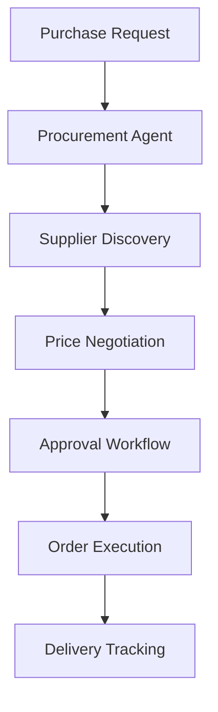
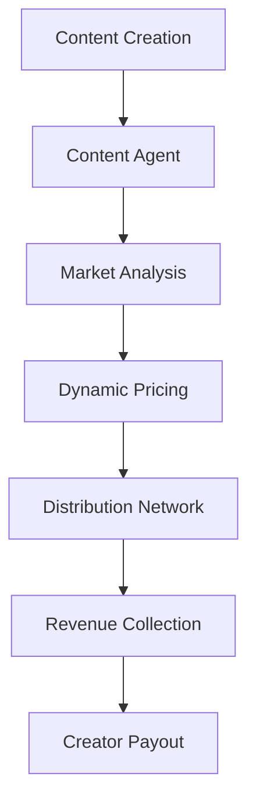
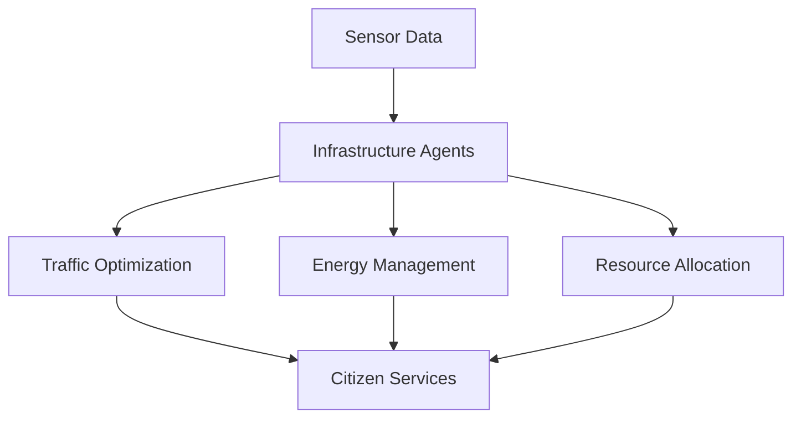
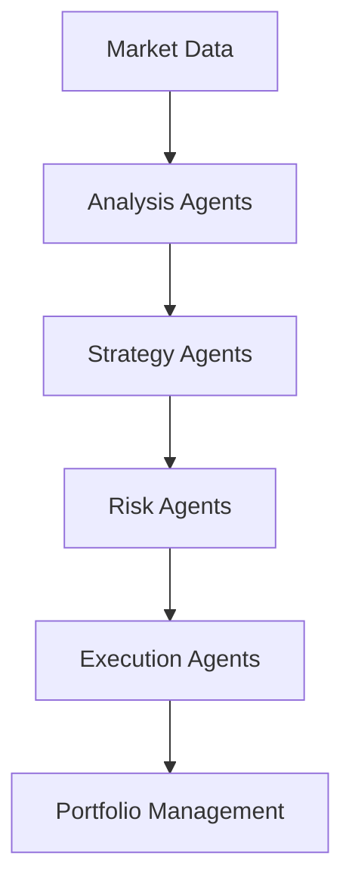
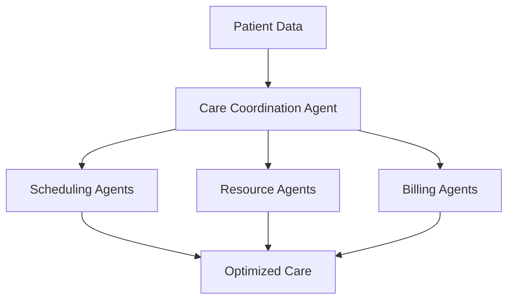

# Agentic Economy Use Cases

Real-world applications and implementation patterns for autonomous AI agents across industries and domains. Each use case includes technical architecture, implementation examples, and business impact metrics.

## 🎯 Use Case Categories

### 💰 [AI Agent Micropayments](./micropayments.md)
**Transform API monetization with crypto micropayments**
- Pay-per-API-call services
- Content paywalls without subscriptions  
- Real-time data streaming monetization
- AI model inference marketplaces

### 🤖 [Multi-Agent Coordination](./coordination.md) 
**Enable autonomous agents to work together seamlessly**
- Distributed task execution
- Agent specialization and delegation
- Cross-organizational workflows
- Autonomous project management

### 🏪 [Autonomous Marketplaces](./marketplaces.md)
**Create self-operating digital marketplaces**
- AI-driven product discovery
- Autonomous pricing and negotiation
- Smart contract automation
- Decentralized reputation systems

### 🏢 [Enterprise Automation](./enterprise.md)
**Streamline business processes with intelligent automation**
- Procurement and supply chain
- Financial operations and reporting
- Customer service and support
- Compliance and risk management

### 💳 [Consumer AI Commerce](./consumer-commerce.md)
**Revolutionary shopping experiences powered by AI**
- Conversational shopping assistants
- Predictive purchasing agents
- Personalized recommendation engines
- Voice-activated commerce

### 🌐 [Cross-Border Payments](./cross-border.md)
**Frictionless global transactions for AI agents**
- International B2B automation
- Remittance optimization
- Multi-currency agent operations
- Regulatory compliance automation

---

## 🚀 Featured Use Cases

### 1. **AI-Powered Procurement Assistant**
**Problem**: Manual procurement processes are slow, error-prone, and expensive
**Solution**: Autonomous agent that handles supplier discovery, negotiation, and purchasing



**Tech Stack**: AP2 + A2A + IBM ACP + Mastercard Agent Pay
**ROI**: 60% faster procurement, 25% cost savings
**Implementation**: [Enterprise Automation Guide](./enterprise.md#procurement-automation)

### 2. **Decentralized Content Marketplace**
**Problem**: Content creators struggle with monetization and fair compensation
**Solution**: Agents automatically price, distribute, and monetize content



**Tech Stack**: x402 + Olas + XMTP + Pay3
**ROI**: 40% higher creator revenue, 80% less platform fees
**Implementation**: [Autonomous Marketplaces Guide](./marketplaces.md#content-marketplace)

### 3. **Smart City Infrastructure**
**Problem**: Urban infrastructure lacks real-time optimization and coordination
**Solution**: Autonomous agents manage traffic, energy, and resource allocation



**Tech Stack**: A2A + MCP + x402 + IBM ACP
**ROI**: 30% efficiency improvement, 20% cost reduction
**Implementation**: [Multi-Agent Coordination Guide](./coordination.md#smart-city)

### 4. **Autonomous Trading Bot Network**
**Problem**: Trading requires 24/7 monitoring and complex strategy execution
**Solution**: Specialized agents collaborate on market analysis and execution



**Tech Stack**: XMTP + Olas + Pay3 + x402
**ROI**: 200% better risk-adjusted returns, 95% automated execution
**Implementation**: [Coordination Guide](./coordination.md#trading-networks)

### 5. **Healthcare Agent Network**
**Problem**: Healthcare coordination across providers is fragmented
**Solution**: Agents coordinate patient care, scheduling, and resource allocation



**Tech Stack**: IBM ACP + AP2 + Mastercard KYA
**ROI**: 35% better patient outcomes, 25% cost reduction
**Implementation**: [Enterprise Automation Guide](./enterprise.md#healthcare)

## 📊 Use Case Impact Matrix

| Use Case | Industry Impact | Technical Complexity | Time to ROI | Scalability |
|----------|----------------|---------------------|-------------|-------------|
| **API Micropayments** | High | Low | < 1 month | Very High |
| **Procurement Automation** | Very High | Medium | 3-6 months | High |
| **Content Marketplace** | High | Medium | 2-4 months | Very High |
| **Smart City** | Very High | High | 6-12 months | Medium |
| **Trading Networks** | High | High | 1-3 months | High |
| **Healthcare Coordination** | Very High | Very High | 6-18 months | Medium |
| **Supply Chain** | Very High | Medium | 3-9 months | High |
| **Customer Service** | Medium | Low | 1-2 months | Very High |

## 🏗️ Implementation Patterns

### Pattern 1: **Single Agent + Tools**
**Best For**: API monetization, content creation, simple automation
**Architecture**: MCP + x402 + basic tooling
**Complexity**: Low
**Example**: [AI Blog Writing Service](./micropayments.md#blog-writing-service)

### Pattern 2: **Agent Coordination**
**Best For**: Complex workflows, multi-step processes  
**Architecture**: A2A + MCP + coordination protocols
**Complexity**: Medium
**Example**: [Event Planning Agents](./coordination.md#event-planning)

### Pattern 3: **Enterprise Integration**
**Best For**: Business process automation, compliance
**Architecture**: IBM ACP + AP2 + enterprise systems
**Complexity**: High  
**Example**: [Financial Reporting Automation](./enterprise.md#financial-reporting)

### Pattern 4: **Decentralized Marketplace**
**Best For**: P2P services, content monetization
**Architecture**: Olas + XMTP + Pay3 + governance
**Complexity**: High
**Example**: [Freelancer Marketplace](./marketplaces.md#freelancer-marketplace)

## 💡 Emerging Use Cases (2025)

### 🔮 **AI Agent Insurance**
Autonomous agents that assess risk and provide insurance coverage for other agents
- **Market Size**: $2B by 2030
- **Key Players**: Early stage startups
- **Technical Requirements**: Risk assessment AI, smart contracts, oracle integration

### 🌍 **Climate Action Coordination** 
Agents that coordinate global climate action and carbon offset programs
- **Market Size**: $15B by 2030  
- **Key Players**: Environmental organizations, governments
- **Technical Requirements**: IoT integration, verification systems, international coordination

### 🧬 **Scientific Research Acceleration**
Agents that accelerate scientific discovery through automated experimentation
- **Market Size**: $50B by 2030
- **Key Players**: Research institutions, pharmaceutical companies
- **Technical Requirements**: Lab automation, data analysis, peer review systems

### 🎓 **Personalized Education Networks**
Agents that create personalized learning experiences and coordinate educational resources
- **Market Size**: $25B by 2030
- **Key Players**: EdTech companies, educational institutions
- **Technical Requirements**: Learning analytics, content curation, progress tracking

## 🛠️ Use Case Development Framework

### Step 1: **Problem Identification**
```yaml
problem_analysis:
  pain_points: [list specific problems]
  stakeholders: [identify all affected parties]
  current_solutions: [analyze existing approaches]
  market_size: [estimate addressable market]
  urgency: [assess timeline pressure]
```

### Step 2: **Agent Design**
```yaml
agent_architecture:
  capabilities: [define what agents can do]
  interactions: [map agent communication patterns]
  protocols: [select appropriate protocols]
  integrations: [identify external systems]
  scalability: [plan for growth]
```

### Step 3: **Implementation Planning**
```yaml
implementation_plan:
  mvp_scope: [minimum viable product]
  success_metrics: [measurable outcomes]
  risk_mitigation: [address potential issues]
  timeline: [realistic development schedule]
  resources: [team and technology needs]
```

### Step 4: **Pilot & Scale**
```yaml
rollout_strategy:
  pilot_criteria: [select pilot participants]
  feedback_loops: [collect user insights]
  iteration_plan: [improve based on feedback]
  scaling_triggers: [metrics that indicate readiness]
  go_to_market: [broader market launch strategy]
```

## 📈 Success Stories

### **Case Study 1: TechCorp Procurement**
**Company**: Fortune 500 Technology Company  
**Challenge**: $2B annual procurement across 10,000 suppliers
**Solution**: Autonomous procurement agents with AP2 + A2A
**Results**: 
- 45% faster procurement cycles
- 30% cost savings ($600M annually)
- 90% reduction in manual processing
- 99.8% compliance rate

### **Case Study 2: CreatorDAO Marketplace**  
**Company**: Decentralized content creation collective
**Challenge**: Fair monetization for 50,000+ creators
**Solution**: x402 + Olas content marketplace
**Results**:
- 60% higher creator earnings
- 95% reduction in platform fees
- 24/7 automated content distribution
- 500K+ micropayments daily

### **Case Study 3: CityFlow Smart Infrastructure**
**Company**: Metropolitan city government  
**Challenge**: Traffic congestion and energy waste
**Solution**: Multi-agent coordination with A2A + IoT integration
**Results**:
- 25% reduction in traffic congestion
- 35% energy efficiency improvement
- $50M annual cost savings
- 15% improvement in citizen satisfaction

## 🎯 Getting Started

### Choose Your Use Case
1. **Assess Your Problem**: Use our [Problem Assessment Tool](./tools/problem-assessment.md)
2. **Select Implementation Pattern**: Match your needs to proven patterns
3. **Review Similar Cases**: Learn from existing implementations
4. **Plan Your Pilot**: Start small and iterate

### Implementation Resources
- **[Boilerplate Code](https://github.com/xpaysh/agentic-economy-boilerplate)**: Working examples for each pattern
- **[Architecture Templates](./templates/)**: Pre-designed system architectures  
- **[Integration Guides](../implementations/)**: Step-by-step implementation instructions
- **[Community Support](../community/)**: Get help from experienced builders

---

**🚀 Ready to build your use case? Start with our [Problem Assessment Tool](./tools/problem-assessment.md) or browse specific use case guides above!**